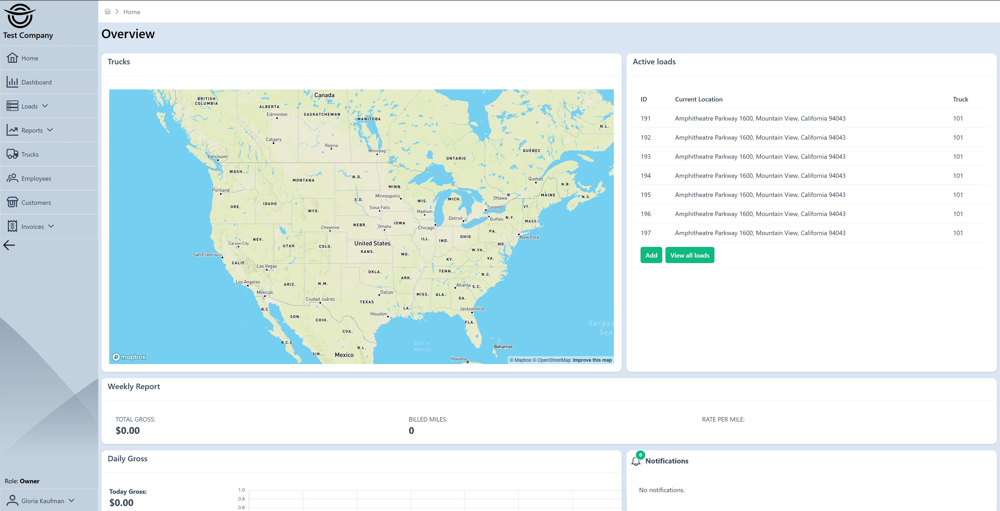

# Logistics TMS

[](https://github.com/suxrobgm/logistics-app/actions/workflows/build.yml)
[](https://github.com/suxrobGM/logistics-app/actions/workflows/deploy.yml)
[![CC BY-NC 4.0][cc-by-nc-shield]][cc-by-nc]

[cc-by-nc]: https://creativecommons.org/licenses/by-nc/4.0/
[cc-by-nc-shield]: https://img.shields.io/badge/License-CC%20BY--NC%204.0-lightgrey.svg

> Multi-tenant fleet management platform for trucking companies. Automates dispatching, GPS tracking, invoicing, and payroll with a modern cloud-native architecture.

## Overview

Logistics TMS is purpose-built for trucking fleets specializing in intermodal containers and vehicle transport. It replaces spreadsheet-based workflows with an end-to-end digital system. The platform connects dispatchers, drivers, and customers through web and mobile applications with real-time synchronization. Built on a modern cloud-native architecture, it scales from small owner-operators to large multi-location fleets while keeping each company's data completely isolated.

**What it does:**

- **Dispatchers** create loads, assign drivers, and monitor deliveries in real-time from the TMS Portal
- **Drivers** receive assignments, navigate to stops, capture proof of delivery, and communicate with dispatch via the mobile app
- **Customers** track their shipments, download documents, and view invoices through the self-service Customer Portal
- **Owners/Managers** access financial reports, driver performance metrics, and operational analytics

**Why it matters:**

- Eliminate paper-based processes and manual data entry
- Reduce miscommunication with real-time messaging and notifications
- Ensure compliance with digital documentation (POD, BOL, DVIR, HOS)
- Improve cash flow with faster invoicing and online payments
- Make data-driven decisions with comprehensive analytics

## Features

### Core Operations

| Feature | Description |
|---------|-------------|
| **Multi-Tenant Architecture** | Complete data isolation per company with separate databases. Each trucking company gets their own secure environment with customizable settings. |
| **Load Management** | Create, assign, and track shipments from origin to destination. Manage pickup/delivery stops, special instructions, and cargo details. |
| **Trip Planning** | Organize multiple loads into trips with optimized routing. Assign drivers and trucks to trips with automatic conflict detection. |
| **Fleet Management** | Track trucks, trailers, and equipment. Monitor maintenance schedules, registration expiration, and vehicle assignments. |
| **Customer Management** | Maintain customer profiles with contact info, billing addresses, and shipment history. Support for multiple contacts per customer. |

### Real-Time Communication

| Feature | Description |
|---------|-------------|
| **GPS Tracking** | Live driver location updates via SignalR WebSocket connections. View all active drivers on an interactive map with route visualization. |
| **In-App Messaging** | Real-time chat between dispatchers and drivers. Supports direct conversations, load-specific threads, and company-wide announcements. Includes read receipts and typing indicators. |
| **Push Notifications** | Instant alerts for load assignments, status changes, and important updates via Firebase Cloud Messaging to mobile devices. |

### Documentation & Compliance

| Feature | Description |
|---------|-------------|
| **Proof of Delivery (POD)** | Capture delivery confirmation with photos, digital signatures, recipient name, and GPS coordinates. Documents stored securely in Azure Blob Storage. |
| **Bill of Lading (BOL)** | Upload and manage BOL documents with automatic association to loads. Support for multiple document formats. |
| **Vehicle Condition Reports** | Pre-trip and post-trip inspections (DVIR) with interactive damage marking on vehicle diagrams. Record damage severity, location, and photos for compliance. |
| **VIN Decoding** | Automatic vehicle information lookup via NHTSA API. Enter a 17-character VIN to retrieve make, model, year, body class, and engine specifications. |
| **ELD/HOS Compliance** | Integration with ELD providers (Samsara, Motive/KeepTruckin) for Hours of Service tracking. Real-time duty status, driving hours, and violation alerts. |
| **Document Storage** | Centralized document management for load paperwork, employee records, and compliance documents with Azure Blob Storage. |

### Financial Management

| Feature | Description |
|---------|-------------|
| **Invoicing** | Generate professional invoices for completed loads. Support for itemized charges, fuel surcharges, and accessorial fees. |
| **Payment Processing** | Accept payments via Stripe integration. Support for credit cards and ACH transfers with automatic reconciliation. |
| **Payroll Management** | Calculate driver pay based on miles, percentage, or flat rates. Generate payroll reports and track payment history. |
| **Financial Reports** | Revenue tracking, expense analysis, and profitability reports by customer, driver, or time period. |

### Analytics & Reporting

| Feature | Description |
|---------|-------------|
| **Operations Dashboard** | Real-time overview of active loads, available drivers, and fleet utilization. Key metrics at a glance. |
| **Driver Performance** | Track on-time delivery rates, miles driven, and efficiency metrics per driver. Identify top performers and improvement areas. |
| **Customer Analytics** | Shipment volume trends, revenue per customer, and customer retention metrics. |
| **Financial Insights** | Daily/weekly/monthly gross revenue, expenses, and profit margins with trend visualization. |

### User Access

| Feature | Description |
|---------|-------------|
| **Role-Based Access Control** | Six user roles with granular permissions: Super Admin, Owner, Manager, Dispatcher, Driver, and Customer. |
| **TMS Portal** | Full-featured web application for dispatchers and managers to manage all operations. |
| **Customer Portal** | Self-service portal for customers to track shipments, view documents, and access invoices. |
| **Driver Mobile App** | Native Android/iOS app for drivers to receive assignments, update statuses, capture POD, and communicate with dispatch. |

## Quick Start

### Option 1: Docker with Aspire (Recommended)

```bash
dotnet run --project src/Aspire/Logistics.Aspire.AppHost
```

Dashboard: <http://localhost:7100>

### Option 2: Manual Setup

See [Local Development Guide](docs/getting-started/local-development.md)

## Live Demo

Try the TMS Portal: [https://tms.suxrobgm.net](https://tms.suxrobgm.net)

Try the Customer Self-Service Portal: [https://customer.suxrobgm.net](https://customer.suxrobgm.net)

**Test Credentials:**

| Role | Email | Password |
|------|-------|----------|
| Owner | <owner@test.com> | Test12345# |
| Manager | <manager1@test.com> | Test12345# |
| Dispatcher | <dispatcher1@test.com> | Test12345# |
| Driver | <driver1@test.com> | Test12345# |
| Customer | <customer1@test.com> | Test12345# |

[All test credentials](docs/getting-started/test-credentials.md)

## Documentation

| Guide | Description |
|-------|-------------|
| [Getting Started](docs/getting-started/prerequisites.md) | Prerequisites, local setup, Docker |
| [Architecture](docs/architecture/overview.md) | System design, patterns, domain model |
| [API Reference](docs/api/overview.md) | Authentication, endpoints, webhooks |
| [Deployment](docs/deployment/overview.md) | VPS setup, Docker Compose, Nginx, SSL |
| [Development](docs/development/backend-guide.md) | Backend, Angular, mobile guides |

## Tech Stack

**.NET 10** | **Angular 21** | **Kotlin Multiplatform** | **PostgreSQL** | **SignalR** | **Stripe** | **Docker** | **Aspire**

[Full tech stack and architecture](docs/architecture/overview.md)

## Applications

| App | Technology | Purpose |
|-----|------------|---------|
| Admin App | Blazor | Super admin management |
| TMS Portal | Angular | Dispatcher/manager interface |
| Customer Portal | Angular | Customer self-service (shipment tracking, documents) |
| Driver App | Kotlin Multiplatform | Mobile app for drivers |
| API | ASP.NET Core | RESTful backend |
| Identity Server | Duende IdentityServer | OAuth2/OIDC auth |

## Contributing

Pull requests welcome! Fork, create a feature branch, and submit a PR.

See [development guides](docs/development/backend-guide.md) for coding conventions.

## License

[Creative Commons Attribution-NonCommercial 4.0][cc-by-nc]

For commercial licensing, contact me.

## Contact

Created by **Sukhrob Ilyosbekov**

- Email: [suxrobgm@test.com](mailto:suxrobgm@test.com)
- Telegram: [@suxrobgm](https://t.me/suxrobgm)

## Preview



[View all screenshots](docs/screenshots.md)
