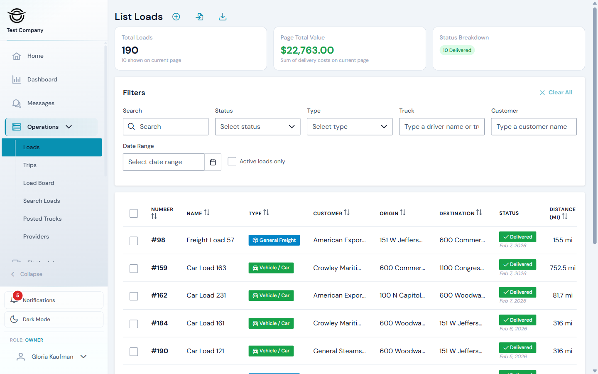
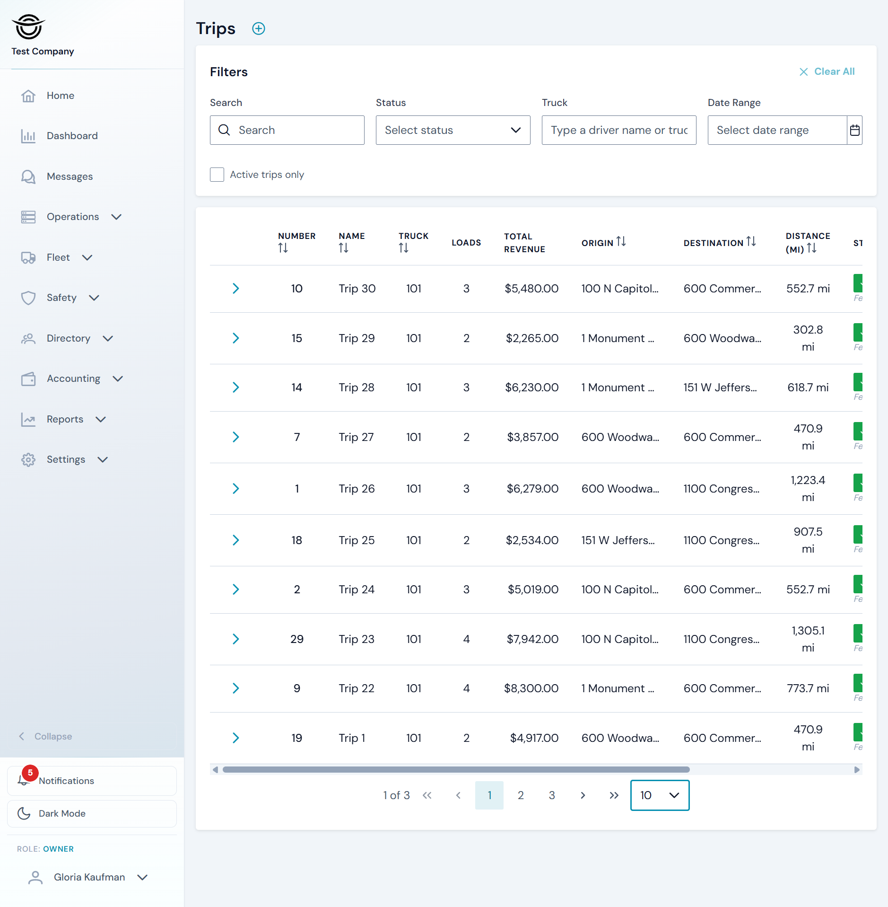
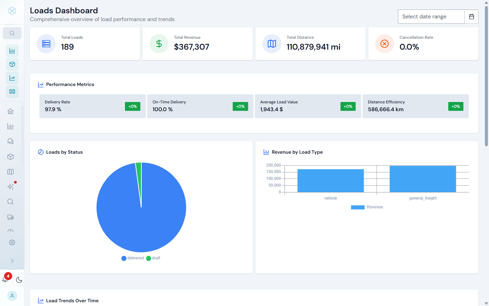
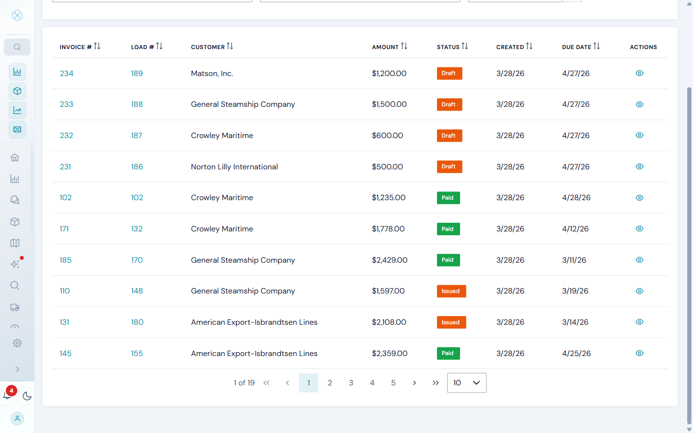
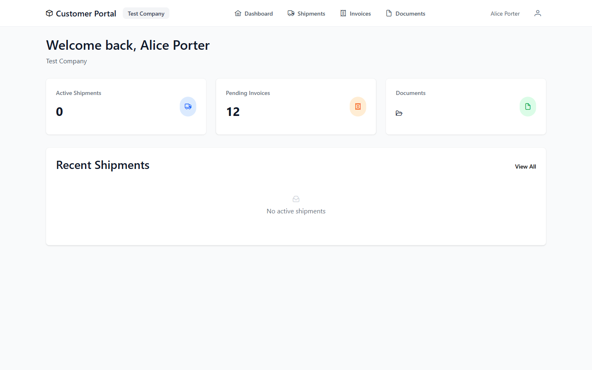
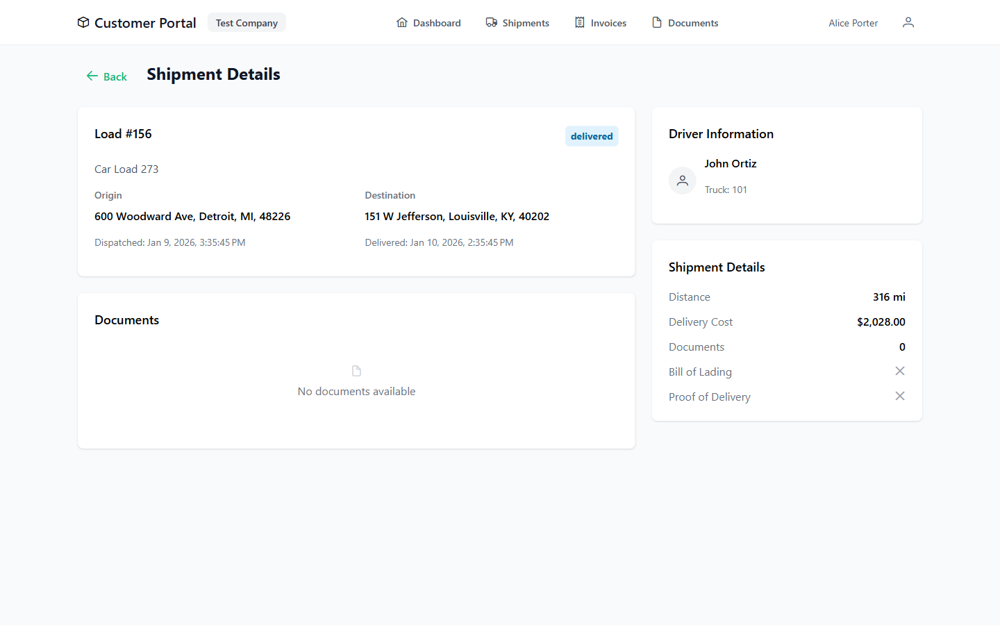

# Logistics TMS

[](https://github.com/suxrobgm/logistics-app/actions/workflows/build.yml)
[](https://github.com/suxrobGM/logistics-app/actions/workflows/deploy.yml)
[![CC BY-NC 4.0][cc-by-nc-shield]][cc-by-nc]

[cc-by-nc]: https://creativecommons.org/licenses/by-nc/4.0/
[cc-by-nc-shield]: https://img.shields.io/badge/License-CC%20BY--NC%204.0-lightgrey.svg

> Multi-tenant fleet management platform for trucking companies. Automates dispatching, GPS tracking, invoicing, and payroll with a modern cloud-native architecture.


## Overview

Logistics TMS is purpose-built for trucking fleets specializing in intermodal containers and vehicle transport. It replaces spreadsheet-based workflows with an end-to-end digital system connecting dispatchers, drivers, and customers through web and mobile applications with real-time synchronization.

**Dispatchers** create loads, assign drivers, search load boards, and monitor deliveries in real-time.
**Drivers** receive assignments, navigate routes, capture proof of delivery, and communicate with dispatch via the mobile app.
**Customers** track shipments, download documents, and pay invoices through the self-service portal.
**Owners** access financial reports, driver performance metrics, payroll, and operational analytics.

## Features

| Operations | Financial | Compliance | Communication |
|:-----------|:----------|:-----------|:--------------|
| Load management & dispatching | Invoicing & Stripe payments | ELD / HOS (Samsara, Motive) | Real-time messaging |
| Trip planning & route optimization | Payroll & timesheets | Safety & DVIR inspections | Push notifications |
| Fleet & maintenance tracking | Expense tracking | Document management (POD, BOL) | Customer self-service portal |
| Load board integration (DAT, Truckstop) | Reports & analytics | Role-based access control | Driver mobile app |

[Complete feature list](docs/features.md)

## Quick Start

### Docker with Aspire (Recommended)

```bash
dotnet run --project src/Aspire/Logistics.Aspire.AppHost
```

Dashboard: http://localhost:7100

### Manual Setup

See [Local Development Guide](docs/getting-started/local-development.md)

## Live Demo

| Portal | URL |
|--------|-----|
| TMS Portal | [tms.suxrobgm.net](https://tms.suxrobgm.net) |
| Customer Portal | [customer.suxrobgm.net](https://customer.suxrobgm.net) |

**Test Credentials:**

| Role | Email | Password |
|------|-------|----------|
| Owner | owner@test.com | Test12345# |
| Manager | manager1@test.com | Test12345# |
| Dispatcher | dispatcher1@test.com | Test12345# |
| Driver | driver1@test.com | Test12345# |
| Customer | customer1@test.com | Test12345# |

[All test credentials](docs/getting-started/test-credentials.md)

## Tech Stack

| Layer | Technologies |
|-------|-------------|
| **Backend** | .NET 10, ASP.NET Core, EF Core, MediatR, SignalR, Duende IdentityServer |
| **Frontend** | Angular 21, PrimeNG, Tailwind CSS |
| **Mobile** | Kotlin Multiplatform, Compose Multiplatform |
| **Database** | PostgreSQL 18 |
| **Payments** | Stripe, Stripe Connect |
| **Infrastructure** | Docker, .NET Aspire, Nginx, GitHub Actions |
| **Integrations** | Mapbox, Firebase, Samsara, Motive, DAT, Truckstop, 123Loadboard |

## Applications

| App | Technology | Port |
|-----|------------|------|
| API | ASP.NET Core | 7000 |
| Identity Server | Duende IdentityServer | 7001 |
| Admin Portal | Angular | 7002 |
| TMS Portal | Angular | 7003 |
| Customer Portal | Angular | 7004 |
| Website | Angular (SSR) | 7005 |
| Driver App | Kotlin Multiplatform | — |

## Architecture

DDD + CQRS with MediatR, multi-tenant with isolated databases per company.

```
src/
├── Aspire/                  # .NET Aspire orchestration
├── Client/
│   ├── Logistics.Angular/   # Angular workspace (4 apps + shared library)
│   └── Logistics.DriverApp/ # Kotlin Multiplatform mobile
├── Core/                    # Domain, Application (CQRS), Mappings
├── Infrastructure/          # 8 focused projects (Persistence, Payments, etc.)
├── Shared/                  # Cross-cutting: Geo, Identity, Models
└── Presentation/            # API, IdentityServer, DbMigrator
```

[Full architecture docs](docs/architecture/overview.md)

## Screenshots

### TMS Portal

| Dashboard | Loads | Trips |
|:---------:|:-----:|:-----:|
|  |  |  |

| Fleet | Reports | Invoicing |
|:-----:|:-------:|:---------:|
|  |  |  |

### Customer Portal

| Dashboard | Shipment Details |
|:---------:|:----------------:|
|  |  |

[All screenshots](docs/screenshots.md)

## Documentation

| Guide | Description |
|-------|-------------|
| [Features](docs/features.md) | Complete feature list |
| [Getting Started](docs/getting-started/prerequisites.md) | Prerequisites, local setup, Docker |
| [Architecture](docs/architecture/overview.md) | System design, patterns, domain model |
| [API Reference](docs/api/overview.md) | Authentication, endpoints, webhooks |
| [Deployment](docs/deployment/overview.md) | VPS setup, Docker Compose, Nginx, SSL |
| [Development](docs/development/backend-guide.md) | Backend, Angular, mobile guides |

## Contributing

Pull requests welcome! Fork, create a feature branch, and submit a PR.

See [development guides](docs/development/backend-guide.md) for coding conventions.

## License

[Creative Commons Attribution-NonCommercial 4.0][cc-by-nc]

For commercial licensing, contact me.

## Contact

Created by **Sukhrob Ilyosbekov**

- Email: [suxrobgm@gmail.com](mailto:suxrobgm@gmail.com)
- LinkedIn: [linkedin.com/in/suxrobgm](https://www.linkedin.com/in/suxrobgm)
- Telegram: [@suxrobgm](https://t.me/suxrobgm)
