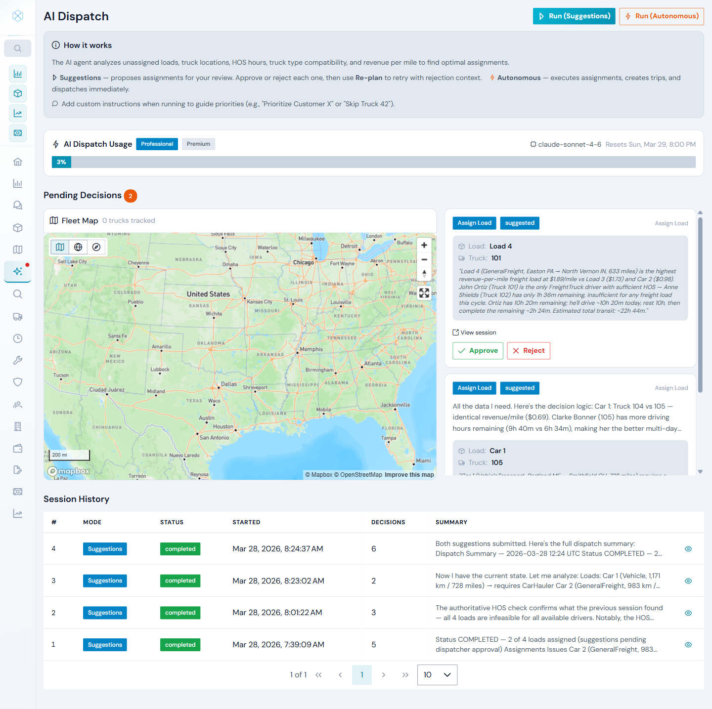
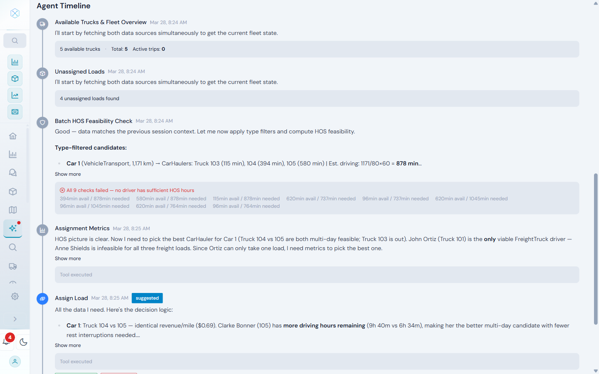
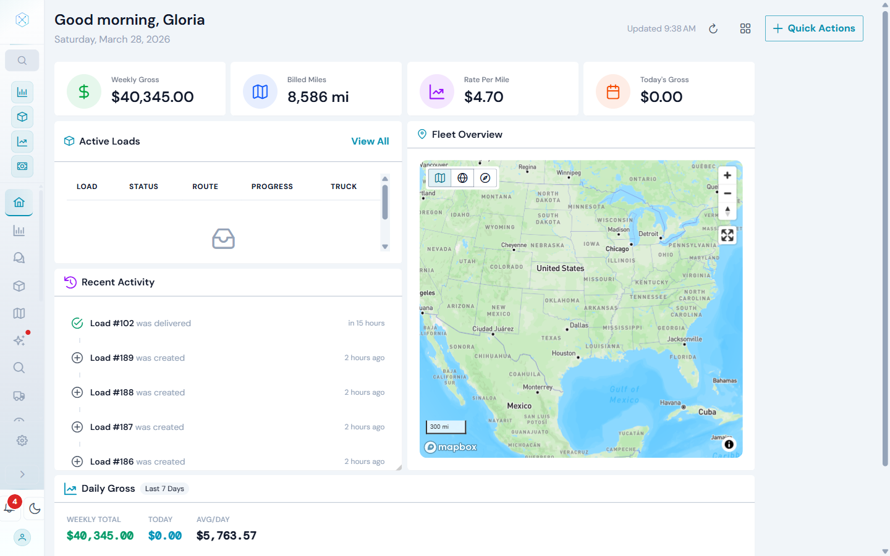
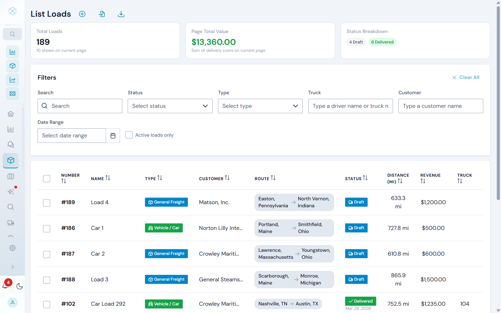
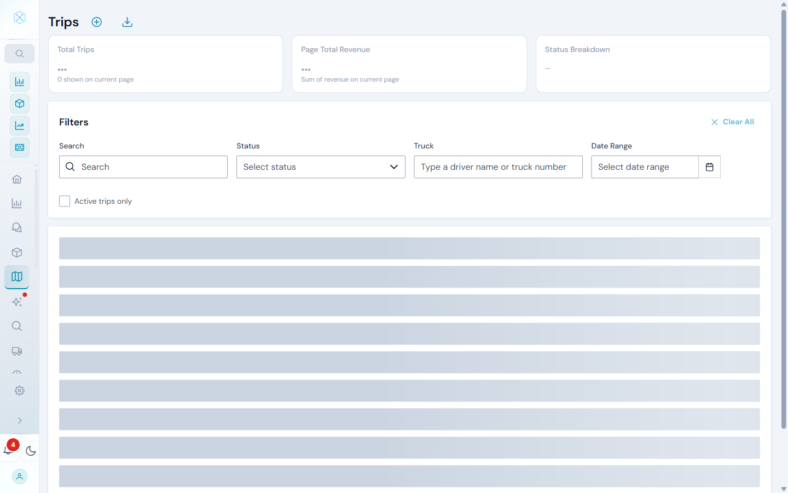
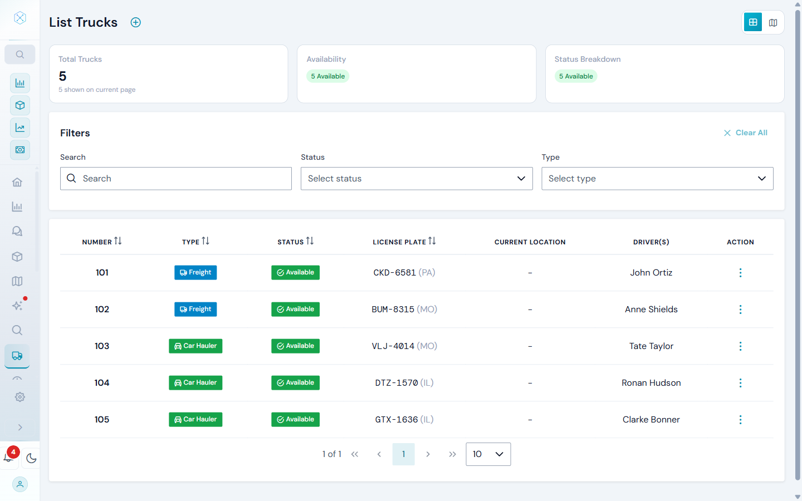
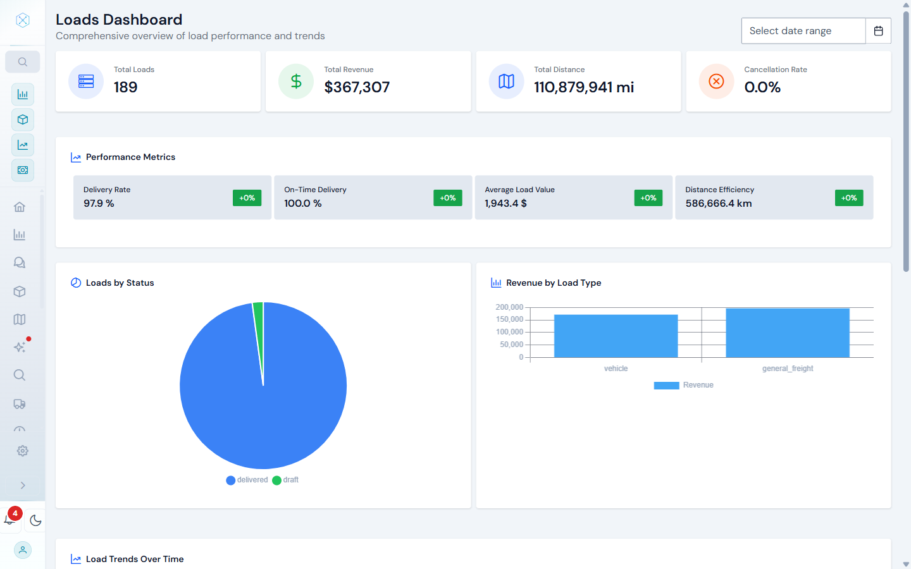
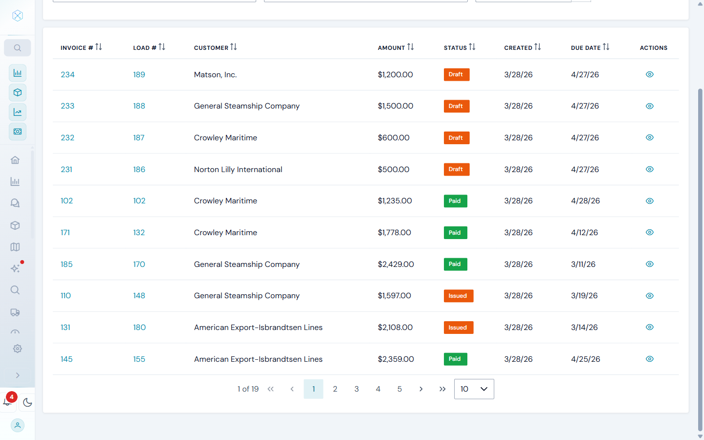
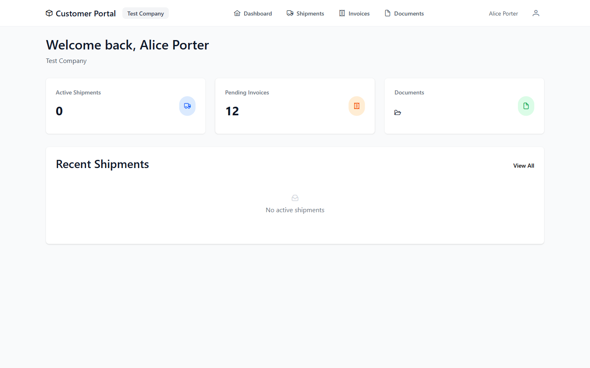
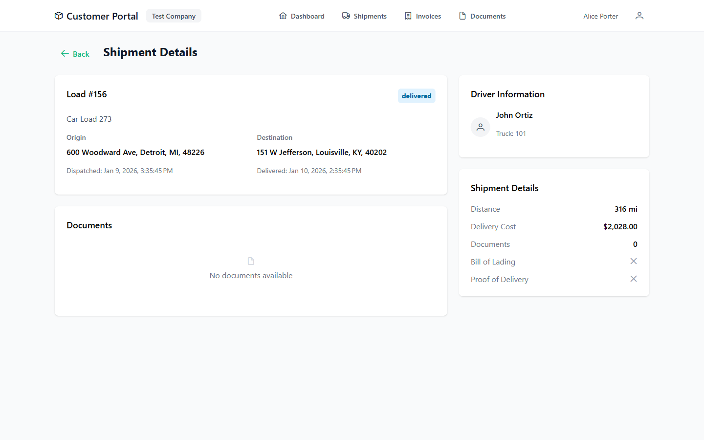

# LogisticsX

[](https://github.com/suxrobgm/logistics-app/actions/workflows/build.yml)
[](https://github.com/suxrobGM/logistics-app/actions/workflows/deploy.yml)
[![CC BY-NC 4.0][cc-by-nc-shield]][cc-by-nc]

[cc-by-nc]: https://creativecommons.org/licenses/by-nc/4.0/
[cc-by-nc-shield]: https://img.shields.io/badge/License-CC%20BY--NC%204.0-lightgrey.svg

> Fleet management platform for trucking companies. An LLM-driven dispatch agent matches loads to trucks, checks HOS compliance, plans routes, and pulls leads from load boards. Every decision it makes is logged so a human can review or override it. Works for dry van, reefer, flatbed, tanker, intermodal, and vehicle transport fleets in the US and Europe, with GPS tracking, invoicing, and payroll built in. Multi-tenant - each company gets its own database.



<!-- markdownlint-disable MD033 -->
<p align="center">
  <a href="https://logisticsx.app"></a>
  <a href="https://tms.logisticsx.app"></a>
</p>

## Overview

LogisticsX is a fleet management platform built for trucking companies. The same system is meant to run whether you are a dry-van long haul fleet, a refrigerated grocery distributor, a heavy-haul flatbed operator, an intermodal drayage company, or a vehicle-transport carrier. Equipment supported includes flatbeds, freight trucks, reefers, tankers, box trucks, dump trucks, tow trucks, car haulers and car transporters, container trucks, low loaders, tautliners, swap bodies, and curtainsiders.

Both **US** and **European** operations are supported out of the box. Each tenant is provisioned with the right region - currency in USD or EUR, country and address validation that matches the region, and map defaults that aren't pinned to one continent. The goal is to take companies off spreadsheets and connect dispatchers, drivers, and customers through a web app, mobile app, and customer portal that stay in sync.

For intermodal operators there's a dedicated container lifecycle: ISO 6346 container tracking (20'/40'/45' GP, High Cube, Reefer, Open Top, Flat Rack, Tank), a state machine for status transitions (Empty → Loaded → At Port → In Transit → Delivered → Returned), and a Terminal directory keyed by UN/LOCODE covering sea ports, rail terminals, inland depots, air cargo facilities, and border crossings.

The piece I'm most invested in is the **AI dispatch agent**. It looks at fleet state, picks a truck for a load, checks HOS compliance, plans a trip, and watches load boards for revenue. There are two modes: **human-in-the-loop**, where the agent only suggests assignments and a dispatcher approves them, and **autonomous**, where it acts on its own. Every decision is logged with the reasoning that produced it, so dispatchers can approve, reject, or re-plan instead of staring at a black box.

Roles in practice:

- **Dispatchers** create loads, assign drivers, search load boards, and watch deliveries - or hand it off to the agent.
- **Drivers** get assignments, navigate routes, capture proof of delivery, and message dispatch from the mobile app.
- **Customers** track shipments, download documents, and pay invoices through the customer portal.
- **Owners** see the financials, driver metrics, payroll, and operational reports.

## Features

| Operations                               | Financial                          | Compliance                      | Communication                |
| :--------------------------------------- | :--------------------------------- | :------------------------------ | :--------------------------- |
| AI-powered dispatching                   | Invoicing & Stripe payments        | ELD / HOS (Samsara, Motive)     | Real-time messaging          |
| MCP server for AI tools                  | Stripe Connect direct payouts      | Safety & DVIR inspections       | Push notifications           |
| Load management & dispatching            | Multi-currency billing (USD / EUR) | Document management (POD, BOL)  | Customer self-service portal |
| Intermodal container tracking (ISO 6346) | Payroll & timesheets               | Region-aware address validation | Driver mobile app            |
| Terminals & depots (UN/LOCODE)           | Expense tracking                   | Role-based access control       |                              |
| Trip planning & route optimization       | Reports & analytics                |                                 |                              |
| Fleet & maintenance tracking             |                                    |                                 |                              |
| Load board integration (DAT, Truckstop)  |                                    |                                 |                              |
| Multi-region support (US + EU)           |                                    |                                 |                              |

[Complete feature list](docs/features.md)

## Quick Start

### Docker with Aspire (Recommended)

```bash
dotnet run --project src/Aspire/Logistics.Aspire.AppHost
```

Dashboard: http://localhost:7100

### Manual Setup

See [Local Development Guide](docs/getting-started/local-development.md)

## Live Demo

| Portal          | URL                                                        |
| --------------- | ---------------------------------------------------------- |
| TMS Portal      | [tms.logisticsx.app](https://tms.logisticsx.app)           |
| Customer Portal | [customer.logisticsx.app](https://customer.logisticsx.app) |

**Test Credentials:**

| Role       | Email                | Password   |
| ---------- | -------------------- | ---------- |
| Owner      | owner@test.com       | Test12345# |
| Manager    | manager1@test.com    | Test12345# |
| Dispatcher | dispatcher1@test.com | Test12345# |
| Driver     | driver1@test.com     | Test12345# |
| Customer   | customer1@test.com   | Test12345# |

[All test credentials](docs/getting-started/test-credentials.md)

## Tech Stack

| Layer              | Technologies                                                                |
| ------------------ | --------------------------------------------------------------------------- |
| **Backend**        | .NET 10, ASP.NET Core, EF Core, MediatR, SignalR, Duende IdentityServer     |
| **Frontend**       | Angular 21, PrimeNG, Tailwind CSS                                           |
| **Mobile**         | Kotlin Multiplatform, Compose Multiplatform                                 |
| **Database**       | PostgreSQL 18                                                               |
| **Payments**       | Stripe, Stripe Connect                                                      |
| **Infrastructure** | Docker, .NET Aspire, Nginx, GitHub Actions                                  |
| **Integrations**   | Mapbox, Firebase, Samsara, Motive, DAT, Truckstop, 123Loadboard, Claude API |

## Applications

| App             | Technology            | Port |
| --------------- | --------------------- | ---- |
| API             | ASP.NET Core          | 7000 |
| Identity Server | Duende IdentityServer | 7001 |
| Admin Portal    | Angular               | 7002 |
| TMS Portal      | Angular               | 7003 |
| Customer Portal | Angular               | 7004 |
| Website         | Angular (SSR)         | 7005 |
| Driver App      | Kotlin Multiplatform  | -    |

## Architecture

DDD + CQRS with MediatR. Multi-tenant with one database per company.

```
src/
├── Aspire/                  # .NET Aspire orchestration
├── Client/
│   ├── Logistics.Angular/   # Angular workspace (4 apps + shared library)
│   └── Logistics.DriverApp/ # Kotlin Multiplatform mobile
├── Core/                    # Domain, Application (CQRS), Mappings
├── Infrastructure/          # 8 focused projects (Persistence, Payments, etc.)
├── Shared/                  # Cross-cutting: Geo, Identity, Models
└── Presentation/            # API, IdentityServer, DbMigrator
```

[Full architecture docs](docs/architecture/overview.md)

## Screenshots

### AI Dispatch

|                     Sessions & Decisions                     |                           Agent Timeline                           |
| :----------------------------------------------------------: | :----------------------------------------------------------------: |
|  |  |

### TMS Portal

|                     Dashboard                     |                     Loads                      |                     Trips                      |
| :-----------------------------------------------: | :--------------------------------------------: | :--------------------------------------------: |
|  |  |  |

|                     Fleet                      |                      Reports                       |                           Invoicing                           |
| :--------------------------------------------: | :------------------------------------------------: | :-----------------------------------------------------------: |
|  |  |  |

### Customer Portal

|                            Dashboard                             |                        Shipment Details                        |
| :--------------------------------------------------------------: | :------------------------------------------------------------: |
|  |  |

[All screenshots](docs/screenshots.md)

## Documentation

| Guide                                                    | Description                                                   |
| -------------------------------------------------------- | ------------------------------------------------------------- |
| [Features](docs/features.md)                             | Complete feature list                                         |
| [Getting Started](docs/getting-started/prerequisites.md) | Prerequisites, local setup, Docker                            |
| [Architecture](docs/architecture/overview.md)            | System design, patterns, domain model                         |
| [API Reference](docs/api/overview.md)                    | Authentication, endpoints, webhooks                           |
| [Deployment](docs/deployment/overview.md)                | VPS setup, Docker Compose, Nginx, SSL                         |
| [AI Dispatch](docs/ai-dispatch.md)                       | Agentic dispatcher architecture & API                         |
| [MCP Server](docs/mcp-server.md)                         | Connect Claude Desktop, Cursor & other AI tools to your fleet |
| [Development](docs/development/backend-guide.md)         | Backend, Angular, mobile guides                               |

## Contributing

Pull requests are welcome. Fork it, branch off main, and open a PR.

See [development guides](docs/development/backend-guide.md) for coding conventions.

## License

[Creative Commons Attribution-NonCommercial 4.0][cc-by-nc]

For commercial licensing, contact me.

## Contact

Created by **Sukhrob Ilyosbekov**

- Email: [suxrobgm@gmail.com](mailto:suxrobgm@gmail.com)
- LinkedIn: [linkedin.com/in/suxrobgm](https://www.linkedin.com/in/suxrobgm)
- Telegram: [@suxrobgm](https://t.me/suxrobgm)
