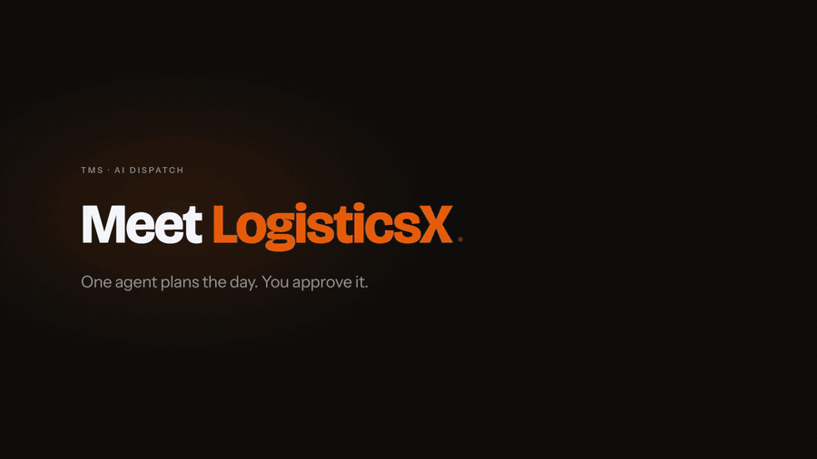

# LogisticsX

[](https://github.com/suxrobGM/logistics-app/actions/workflows/build.yml)
[](https://github.com/suxrobGM/logistics-app/actions/workflows/deploy.yml)
[![PolyForm-Noncommercial-1.0.0][license-shield]][license]

[license]: https://polyformproject.org/licenses/noncommercial/1.0.0/
[license-shield]: https://img.shields.io/badge/License-PolyForm--Noncommercial--1.0.0-blue.svg

LogisticsX is a fleet management system for trucking companies. It handles dispatch, driver trips, customer tracking, invoicing, and payroll in one place. An AI dispatcher can plan the day for you, and you approve or change what it suggests.



_The AI dispatcher planning a day of assignments. [Watch the 60 second tour](https://logisticsx.app)._

<!-- markdownlint-disable MD033 -->
<p align="center">
  <a href="https://logisticsx.app"></a>
  <a href="https://tms.logisticsx.app"></a>
</p>

## Try the demo

No signup needed. Open a portal and log in with one of the demo accounts below. The password for every account is `Test12345#`.

| Portal                                                     | Who uses it                   |
| ---------------------------------------------------------- | ----------------------------- |
| [tms.logisticsx.app](https://tms.logisticsx.app)           | Owners, managers, dispatchers |
| [customer.logisticsx.app](https://customer.logisticsx.app) | Customers                     |

The demo company is Heartland Logistics LLC, a US carrier with 10 employees:

| Role       | Email                  |
| ---------- | ---------------------- |
| Owner      | `owner@test.com`       |
| Manager    | `manager1@test.com`    |
| Dispatcher | `dispatcher1@test.com` |
| Driver     | `driver1@test.com`     |
| Customer   | `customer1@test.com`   |

<details>
<summary>Two more demo companies</summary>

**EuroFreight GmbH** is a European carrier. It bills in euros, uses metric units, and runs on Berlin time.

| Role       | Email                     |
| ---------- | ------------------------- |
| Owner      | `eu_owner@test.com`       |
| Manager    | `eu_manager@test.com`     |
| Dispatcher | `eu_dispatcher1@test.com` |
| Driver     | `eu_driver1@test.com`     |
| Customer   | `eu_customer1@test.com`   |

**Rodriguez Trucking LLC** is a one-person company in solo mode. The owner also drives the truck, so the same login works in the TMS portal and the driver app.

| Role     | Email                     |
| -------- | ------------------------- |
| Owner    | `solo@test.com`           |
| Customer | `solo_customer1@test.com` |

</details>

The full list of demo accounts is in [test-credentials.md](docs/getting-started/test-credentials.md).

## What it does

Most small carriers run on spreadsheets, group chats, and a few separate tools for accounting and tracking. LogisticsX puts all of that in one system. When a dispatcher assigns a load, the driver sees it on their phone, the customer can track it, and the invoice is ready when the load is delivered.

It is built for freight, vehicle transport, and container drayage. Other fleet types such as reefer, flatbed, and tanker work too, but you may need to adjust some workflows. Companies in the US and in Europe are both supported, with the right currency, units, and address formats for each.

Each role gets its own view:

- Dispatchers create loads, assign drivers, search load boards, and follow deliveries. They can also hand the work to the AI dispatcher.
- Drivers get their assignments, follow the route, take proof of delivery photos, and message dispatch from the mobile app.
- Customers track shipments, download documents, and pay invoices in the customer portal.
- Owners see the money, driver performance, payroll, and reports.

If you are an owner-operator, turn on solo mode. It hides the team screens (employees, payroll, messaging), shortens the setup checklist, and tells the AI dispatcher it is working with one truck.

## How the AI helps

There are two assistants, and both show their reasoning for every action so you can check the work.

The **dispatch agent** looks at your trucks and loads, picks a truck for each load, checks that the driver has enough hours left, plans the trip, and watches load boards for new work. It suggests, and a dispatcher approves or rejects each assignment with a reason.

The **copilot** is a chat panel available on every page of the portal. Ask it which trucks are due for service, how much you spent on fuel last month, or tell it to invoice the loads delivered today. It only sees the parts of the system your role can access, and it asks before it changes anything.

You can also connect Claude Desktop, Cursor, or other AI tools to your fleet through the built-in MCP server.

Read more in [AI Dispatch](docs/ai-dispatch.md), [AI Copilot](docs/ai-copilot.md), and [MCP Server](docs/mcp-server.md).

## Features

### Dispatch and operations

- Loads, multi-stop trips, and route planning on Mapbox.
- A live map of your drivers, and tracking links you can share with anyone.
- Search DAT, Truckstop, and 123Loadboard from one screen. Book a load or post an open truck.
- A broker credit check on every listing. Bookings below your minimum score are blocked unless a dispatcher overrides.
- Import a load from a rate confirmation PDF.
- Container tracking (ISO 6346) and a terminal directory keyed by UN/LOCODE.
- Trucks, trailers, maintenance schedules, and VIN lookup.

### AI

- A dispatch agent that assigns loads, checks hours of service, and plans trips. It suggests, you approve.
- A copilot chat on every page for questions, invoicing, expenses, and maintenance.
- Counter-offer emails to brokers when a load pays below your lane floor. You approve each one before it sends.
- The agent learns your dispatch preferences from the decisions you approve and reject.
- An MCP server so Claude Desktop, Cursor, and other AI tools can work with your fleet.

### Money

- Invoices per load, with tax from Stripe Tax or your own rates (US sales tax, EU VAT).
- Card and bank payments through Stripe, with payment links and partial payments.
- Direct payouts to your bank account through Stripe Connect.
- Payroll by mile, share of gross, hourly, or a fixed salary, with timesheets and pay stubs.
- Expense tracking. WEX and EFS fuel card transactions import every night.
- QuickBooks Online sync for customers, invoices, payments, and expenses.
- Billing in USD or EUR.

### Compliance and safety

- Hours of service from Samsara, Motive, Geotab, and TT ELD.
- Quarterly IFTA fuel tax reports with PDF and CSV export.
- Driver inspections (DVIR), accident reports, and driver behavior events.
- Driver license tracking with expiry reminders.
- Hazmat loads only go to trucks with the right ADR equipment.
- Documents such as proof of delivery and bills of lading.
- GDPR tools: data export, deletion requests, and retention rules.

### Reports

- Revenue, financials, loads, drivers, team, payroll, maintenance, safety, and IFTA.

### Communication

- Chat between dispatch and drivers with read receipts.
- Push, email, and in-app notifications.
- A customer portal for tracking, documents, and paying invoices.
- A driver app for Android and iOS.

### Teams and access

- Seven roles, from super admin to customer, each with its own permissions.
- Email invitations for new team members.
- Solo mode for owner-operators.

The full list is in [features.md](docs/features.md).

## Run it on your machine

You need the [.NET 10 SDK](https://dotnet.microsoft.com/download/dotnet/10.0), [Bun](https://bun.sh), and Docker Desktop.

```bash
git clone https://github.com/suxrobGM/logistics-app.git
cd logistics-app

# Start Postgres and seed the demo companies
docker compose -f deploy/docker-compose.dev.yml up -d

# Start the backend (two terminals)
dotnet run --project src/Presentation/Logistics.IdentityServer
dotnet run --project src/Presentation/Logistics.API

# Start the TMS portal
bun install
bun start:tms
```

Open <http://localhost:7003> and log in as `owner@test.com` with password `Test12345#`.

The [Docker guide](docs/getting-started/docker-development.md) lists every service and port. If you would rather run Postgres yourself, follow the [local setup guide](docs/getting-started/local-development.md).

## Built with

| Part         | Stack                                                                       |
| ------------ | --------------------------------------------------------------------------- |
| Backend      | .NET 10, ASP.NET Core, EF Core, SignalR, Duende IdentityServer              |
| Web portals  | Angular 22, spartan/ui, Tailwind CSS                                        |
| Driver app   | Kotlin Multiplatform, Compose Multiplatform                                 |
| Database     | PostgreSQL 18, one database per company                                     |
| Payments     | Stripe, Stripe Connect                                                      |
| Hosting      | Docker Compose, Nginx, GitHub Actions                                       |
| Integrations | Mapbox, Firebase, Samsara, Motive, DAT, Truckstop, 123Loadboard, Claude API |

The [architecture overview](docs/architecture/overview.md) explains how the pieces fit together.

## Screenshots

|                        Agent timeline                        |                    Dispatch plan                     |
| :----------------------------------------------------------: | :--------------------------------------------------: |
|  |  |

|                          Broker rate thread                          |                       Pending decisions                        |
| :------------------------------------------------------------------: | :------------------------------------------------------------: |
|  |  |

### Driver app


<details>
<summary>More screenshots</summary>

### TMS portal

|                     Dashboard                     |                     Loads                      |                     Trips                      |
| :-----------------------------------------------: | :--------------------------------------------: | :--------------------------------------------: |
|  |  |  |

|                     Fleet                      |                 ELD / HOS                  |                        Maintenance                         |
| :--------------------------------------------: | :----------------------------------------: | :--------------------------------------------------------: |
|  |  |  |

|                           Invoicing                           |                      Payroll                       |                        IFTA                         |
| :-----------------------------------------------------------: | :------------------------------------------------: | :-------------------------------------------------: |
|  |  |  |

### Customer portal

|                            Dashboard                             |                        Shipment details                        |
| :--------------------------------------------------------------: | :------------------------------------------------------------: |
|  |  |

### Driver app screens

|                           Trips                            |                              Trip detail                               |                              Load detail                               |
| :--------------------------------------------------------: | :--------------------------------------------------------------------: | :--------------------------------------------------------------------: |
|  |  |  |

</details>

More in [screenshots.md](docs/screenshots.md).

## Documentation

| Guide                                                    | What is in it                                                |
| -------------------------------------------------------- | ------------------------------------------------------------ |
| [Features](docs/features.md)                             | Everything the system can do                                 |
| [Getting started](docs/getting-started/prerequisites.md) | Tools to install, local setup, Docker                        |
| [Architecture](docs/architecture/overview.md)            | How the system is put together                               |
| [API reference](docs/api/overview.md)                    | Login, endpoints, webhooks                                   |
| [Deployment](docs/deployment/overview.md)                | Running it on your own server with Docker and SSL            |
| [AI Dispatch](docs/ai-dispatch.md)                       | How the dispatch agent works                                 |
| [AI Copilot](docs/ai-copilot.md)                         | How the copilot works, approvals, permissions                |
| [MCP Server](docs/mcp-server.md)                         | Connecting Claude Desktop, Cursor, and other AI tools        |
| [Development](docs/development/backend-guide.md)         | Guides for the backend, the Angular apps, and the mobile app |

## Contributing

Pull requests are welcome. Fork the repo, branch off `main`, and open a PR. Coding conventions are in the [development guides](docs/development/backend-guide.md).

You will be asked to sign the [Contributor License Agreement](CLA.md) on your first pull request. You keep your copyright. The agreement lets the project be offered under both the noncommercial and the commercial license.

## License

LogisticsX is released under the [PolyForm Noncommercial License 1.0.0][license].

It is free for personal projects, research, education, and evaluation. If you want to run it inside a business or host it for others, you need a commercial license. See [COMMERCIAL-LICENSE.md](COMMERCIAL-LICENSE.md) for the options and prices, or email [suxrobgm@gmail.com](mailto:suxrobgm@gmail.com).

## Contact

Built by Sukhrob Ilyosbekov.

- Email: [suxrobgm@gmail.com](mailto:suxrobgm@gmail.com)
- LinkedIn: [linkedin.com/in/suxrobgm](https://www.linkedin.com/in/suxrobgm)
- Telegram: [@suxrobgm](https://t.me/suxrobgm)
