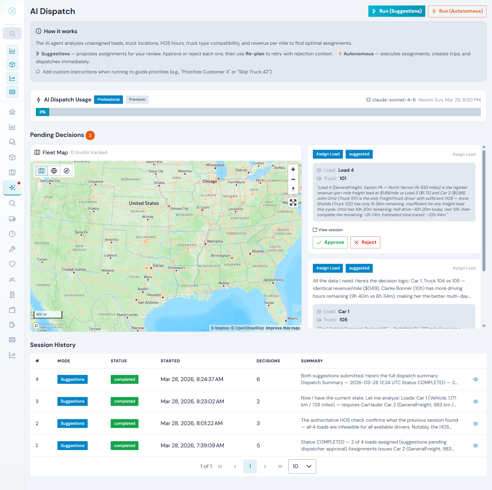
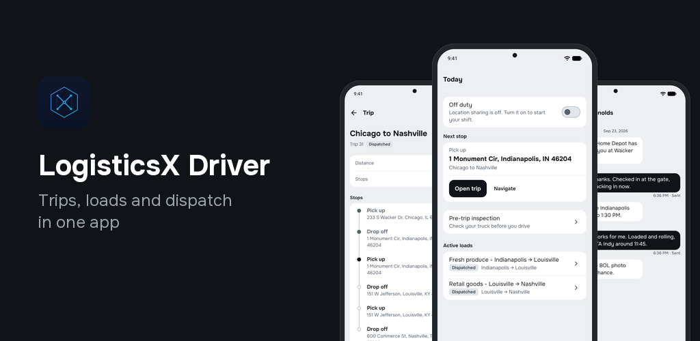

# LogisticsX

[](https://github.com/suxrobgm/logistics-app/actions/workflows/build.yml)
[](https://github.com/suxrobGM/logistics-app/actions/workflows/deploy.yml)
[![PolyForm-Noncommercial-1.0.0][license-shield]][license]

[license]: https://polyformproject.org/licenses/noncommercial/1.0.0/
[license-shield]: https://img.shields.io/badge/License-PolyForm--Noncommercial--1.0.0-blue.svg

> Fleet management platform for trucking companies. AI runs through it: a dispatch agent matches loads to trucks, checks HOS compliance, plans routes, and pulls leads from load boards, while a TMS-wide copilot answers questions and handles invoicing, expenses, and maintenance from a chat drawer - every decision logged so a human can review or override it.



<!-- markdownlint-disable MD033 -->
<p align="center">
  <a href="https://logisticsx.app"></a>
  <a href="https://tms.logisticsx.app"></a>
</p>

## Try it

| Portal          | URL                                                        |
| --------------- | ---------------------------------------------------------- |
| TMS Portal      | [tms.logisticsx.app](https://tms.logisticsx.app)           |
| Customer Portal | [customer.logisticsx.app](https://customer.logisticsx.app) |

**US tenant** (Heartland Logistics LLC):

| Role       | Email                  | Password   |
| ---------- | ---------------------- | ---------- |
| Owner      | `owner@test.com`       | Test12345# |
| Manager    | `manager1@test.com`    | Test12345# |
| Dispatcher | `dispatcher1@test.com` | Test12345# |
| Driver     | `driver1@test.com`     | Test12345# |
| Customer   | `customer1@test.com`   | Test12345# |

**EU tenant** (EuroFreight GmbH - EUR billing, metric units, Europe/Berlin):

| Role       | Email                     | Password   |
| ---------- | ------------------------- | ---------- |
| Owner      | `eu_owner@test.com`       | Test12345# |
| Manager    | `eu_manager@test.com`     | Test12345# |
| Dispatcher | `eu_dispatcher1@test.com` | Test12345# |
| Driver     | `eu_driver1@test.com`     | Test12345# |
| Customer   | `eu_customer1@test.com`   | Test12345# |

**Solo tenant** (Rodriguez Trucking LLC - owner-operator mode, one person and one truck):

| Role     | Email                     | Password   |
| -------- | ------------------------- | ---------- |
| Owner    | `solo@test.com`           | Test12345# |
| Customer | `solo_customer1@test.com` | Test12345# |

`solo@test.com` is the only employee - they own the company and drive the truck, so the same login works in the TMS portal and the driver app.

[All test credentials](docs/getting-started/test-credentials.md)

## Who it's for

LogisticsX is built first-class for **freight, vehicle transport, and intermodal drayage** operations. Other fleet types (refrigerated, flatbed, tanker, etc.) are supported experimentally and may need workflow tweaks. The platform replaces the patchwork of spreadsheets, group chats, and standalone TMS/accounting tools - dispatch, driver mobile app, customer tracking, invoicing, and payroll all run from the same system, in real time. Works across both **US and EU** operations, with multi-tenant isolation so each company gets its own database.

Roles:

- **Dispatchers** create loads, assign drivers, search load boards, and watch deliveries - or hand it off to the agent.
- **Drivers** get assignments, navigate routes, capture proof of delivery, and message dispatch from the mobile app.
- **Customers** track shipments, download documents, and pay invoices through the customer portal.
- **Owners** see financials, driver metrics, payroll, and operational reports.

One person can be several of these. An owner-operator switches the company to **solo mode**, which hides the team screens (employees, payroll, messaging), trims the setup checklist, and points the AI agent at a one-truck operation. The same Owner login runs the TMS portal and the driver app.

## AI agents

**Dispatch agent** - looks at fleet state, picks a truck for a load, checks HOS compliance, plans a trip, and watches load boards for revenue. Two modes:

- **Human-in-the-loop** - the agent suggests assignments; a dispatcher approves them.
- **Autonomous** - the agent acts on its own.

**TMS-wide copilot** - a chat drawer across the whole portal. Ask it about loads, spend, or which trucks are due for service, or have it invoice delivered loads and send payment links. It only sees the tools your role permits, and every write action waits for your approval.

Every decision either agent makes is logged with the reasoning that produced it, so you approve, reject, or re-plan instead of staring at a black box. See [AI Dispatch](docs/ai-dispatch.md), [AI Copilot](docs/ai-copilot.md), and [MCP Server](docs/mcp-server.md) for connecting Claude Desktop, Cursor, and other AI tools to your fleet.

## Features

| Operations                               | Financial                          | Compliance                      | Communication                |
| :--------------------------------------- | :--------------------------------- | :------------------------------ | :--------------------------- |
| AI-powered dispatching                   | Invoicing & Stripe payments        | ELD / HOS (Samsara, Motive)     | Real-time messaging          |
| TMS-wide AI copilot                      | Stripe Connect direct payouts      | Safety & DVIR inspections       | Push notifications           |
| MCP server for AI tools                  | Multi-currency billing (USD / EUR) | Document management (POD, BOL)  | Customer self-service portal |
| Trip planning & route optimization       | Payroll & timesheets               | Region-aware address validation | Driver mobile app            |
| Intermodal container tracking (ISO 6346) | Expense tracking                   | Role-based access control       |                              |
| Terminals & depots (UN/LOCODE)           | Reports & analytics                |                                 |                              |
| Fleet & maintenance tracking             |                                    |                                 |                              |
| Load board integration (DAT, Truckstop)  |                                    |                                 |                              |

[Complete feature list](docs/features.md)

## Quick start

```bash
# Start local infrastructure (Postgres, runs the DB migrator once)
docker compose -f deploy/docker-compose.dev.yml up -d

# Then run the backend + a frontend
dotnet run --project src/Presentation/Logistics.IdentityServer
dotnet run --project src/Presentation/Logistics.API
bun start:tms
```

For full setup details, see the [Local Development Guide](docs/getting-started/local-development.md).

## Tech stack

| Layer              | Technologies                                                                |
| ------------------ | --------------------------------------------------------------------------- |
| **Backend**        | .NET 10, ASP.NET Core, EF Core, MediatR, SignalR, Duende IdentityServer     |
| **Frontend**       | Angular 22, spartan/ui, Tailwind CSS                                        |
| **Mobile**         | Kotlin Multiplatform, Compose Multiplatform                                 |
| **Database**       | PostgreSQL 18                                                               |
| **Payments**       | Stripe, Stripe Connect                                                      |
| **Infrastructure** | Docker, Docker Compose, Nginx, GitHub Actions                               |
| **Integrations**   | Mapbox, Firebase, Samsara, Motive, DAT, Truckstop, 123Loadboard, Claude API |

Architecture: DDD + CQRS with MediatR, multi-tenant with one database per company. See [architecture overview](docs/architecture/overview.md).

| App             | Port |
| --------------- | ---- |
| API             | 7000 |
| Identity Server | 7001 |
| Admin Portal    | 7002 |
| TMS Portal      | 7003 |
| Customer Portal | 7004 |
| Website         | 7005 |

## Screenshots

|                     Sessions & Decisions                     |                        Agent Timeline                        |
| :----------------------------------------------------------: | :----------------------------------------------------------: |
|  |  |

### Driver Mobile App



<details>
<summary>More screenshots</summary>

### TMS Portal

|                     Dashboard                     |                     Loads                      |                     Trips                      |
| :-----------------------------------------------: | :--------------------------------------------: | :--------------------------------------------: |
|  |  |  |

|                     Fleet                      |                      Reports                       |                           Invoicing                           |
| :--------------------------------------------: | :------------------------------------------------: | :-----------------------------------------------------------: |
|  |  |  |

### Customer Portal

|                            Dashboard                             |                        Shipment Details                        |
| :--------------------------------------------------------------: | :------------------------------------------------------------: |
|  |  |

### Driver Mobile App Screens

|                           Trips                            |                              Trip Detail                               |                              Load Detail                               |
| :--------------------------------------------------------: | :--------------------------------------------------------------------: | :--------------------------------------------------------------------: |
|  |  |  |

</details>

[All screenshots](docs/screenshots.md)

## Documentation

| Guide                                                    | Description                                                   |
| -------------------------------------------------------- | ------------------------------------------------------------- |
| [Features](docs/features.md)                             | Complete feature list                                         |
| [Getting Started](docs/getting-started/prerequisites.md) | Prerequisites, local setup, Docker                            |
| [Architecture](docs/architecture/overview.md)            | System design, patterns, domain model                         |
| [API Reference](docs/api/overview.md)                    | Authentication, endpoints, webhooks                           |
| [Deployment](docs/deployment/overview.md)                | VPS setup, Docker Compose, Nginx, SSL                         |
| [AI Dispatch](docs/ai-dispatch.md)                       | Agentic dispatcher architecture & API                         |
| [AI Copilot](docs/ai-copilot.md)                         | Conversational TMS agent: transcript, approvals, permissions  |
| [MCP Server](docs/mcp-server.md)                         | Connect Claude Desktop, Cursor & other AI tools to your fleet |
| [Development](docs/development/backend-guide.md)         | Backend, Angular, mobile guides                               |

## Contributing

Pull requests welcome. Fork, branch off `main`, open a PR. See the [development guides](docs/development/backend-guide.md) for coding conventions.

## License

[PolyForm Noncommercial License 1.0.0][license]

The source is public and free for noncommercial use: personal projects, research, education, and evaluation. Any commercial use requires a paid commercial license from the author, with no time limit or automatic conversion. This includes running LogisticsX inside a for-profit company and offering it to others as a product or hosted service. To buy a commercial license, email [suxrobgm@gmail.com](mailto:suxrobgm@gmail.com).

## Contact

Created by **Sukhrob Ilyosbekov**

- Email: [suxrobgm@gmail.com](mailto:suxrobgm@gmail.com)
- LinkedIn: [linkedin.com/in/suxrobgm](https://www.linkedin.com/in/suxrobgm)
- Telegram: [@suxrobgm](https://t.me/suxrobgm)
