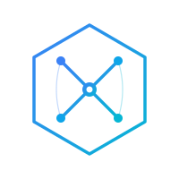
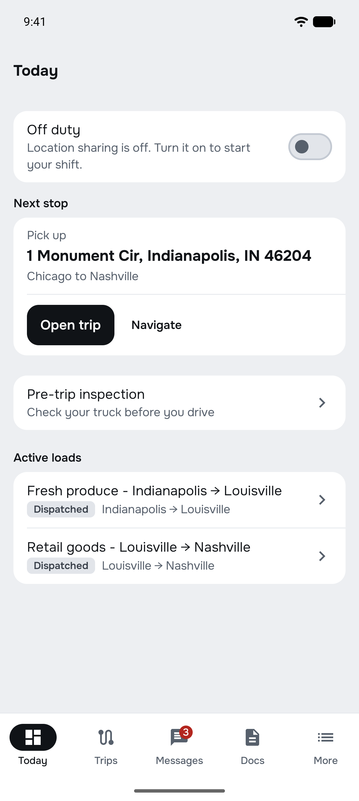
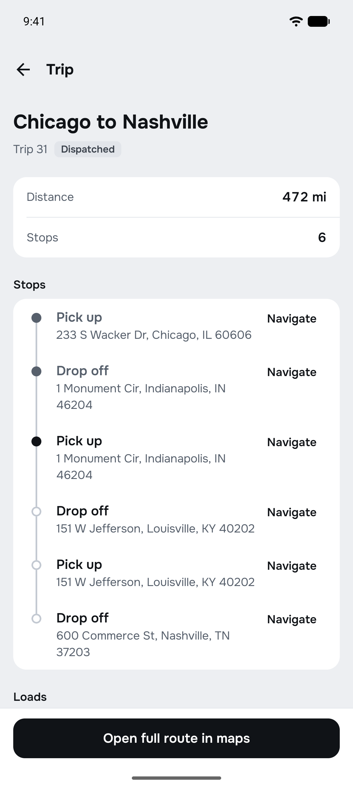

<!-- markdownlint-disable MD033 MD041 -->
<p align="center">
  
</p>

<h1 align="center">LogisticsX</h1>

<p align="center">
  Fleet management for trucking companies. Dispatch, drivers, customers, invoicing, and payroll in one system,<br>
  with an AI dispatcher that plans the day and waits for your approval.
</p>

<p align="center">
  <a href="https://github.com/suxrobGM/logistics-app/actions/workflows/build.yml"></a>
  <a href="https://github.com/suxrobGM/logistics-app/actions/workflows/deploy.yml"></a>
  <a href="https://polyformproject.org/licenses/noncommercial/1.0.0"></a>
</p>

<p align="center">
  <a href="https://logisticsx.app"></a>
  <a href="https://tms.logisticsx.app"></a>
</p>


<p align="center"><i>The AI dispatcher planning a day of work. <a href="https://logisticsx.app">Watch the 60-second tour</a>.</i></p>

## Try the demo

No signup. Every demo account uses the password `Test12345#`.

| Where                                              | Log in as                                                     |
| -------------------------------------------------- | ------------------------------------------------------------- |
| [TMS portal](https://tms.logisticsx.app)           | `owner@test.com`, `manager1@test.com`, `dispatcher1@test.com` |
| [Customer portal](https://customer.logisticsx.app) | `customer1@test.com`                                          |
| Driver app                                         | `driver1@test.com`                                            |

These accounts belong to Heartland Logistics LLC, a US carrier with 10 employees.

<details>
<summary>Two more demo companies</summary>

**EuroFreight GmbH** bills in euros, uses metric units, and runs on Berlin time. Log in as `eu_owner@test.com`, `eu_manager@test.com`, `eu_dispatcher1@test.com`, `eu_driver1@test.com`, or `eu_customer1@test.com`.

**Rodriguez Trucking LLC** is a solo owner-operator. The owner also drives, so `solo@test.com` works in both the TMS portal and the driver app. Its customer is `solo_customer1@test.com`.

</details>

All demo accounts are in [test-credentials.md](docs/getting-started/test-credentials.md).

## What it does

Small carriers often run on spreadsheets, group chats, and separate tools for accounting and tracking. LogisticsX puts all of it in one place. A dispatcher assigns a load, the driver sees it in the app, the customer tracks it, and the invoice is ready on delivery.

It supports general freight, car hauling, and container drayage, for carriers in the US and Europe.

| Area        | Highlights                                                                                               |
| ----------- | -------------------------------------------------------------------------------------------------------- |
| Dispatch    | Loads, multi-stop trips, Mapbox routing, a live driver map, and tracking links you can share             |
| Load boards | Search and book on DAT, Truckstop, and 123Loadboard, with a broker credit check on every listing         |
| Money       | Invoices with US sales tax or EU VAT, Stripe payments and payouts, payroll, and QuickBooks sync          |
| Fuel        | WEX and EFS fuel card imports every night, plus quarterly IFTA reports                                   |
| Compliance  | Hours of service from Samsara, Motive, Geotab, and TT ELD, driver inspections, hazmat checks, GDPR tools |
| Fleet       | Trucks, trailers, maintenance schedules, VIN lookup, and container tracking (ISO 6346)                   |
| Apps        | A TMS portal, a customer portal, an admin portal, and a driver app for Android and iOS                   |

The full list is in [features.md](docs/features.md).

## AI that asks first

The **dispatch agent** matches trucks to loads, checks each driver's remaining hours, plans trips, and watches load boards. A dispatcher approves or rejects every assignment, and the agent learns from those decisions. It can also send counter-offers to brokers when a load pays below your lane floor.

The **copilot** is a chat panel on every page. Ask it which trucks are due for service, or tell it to invoice today's deliveries. It sees only what your role can see, and it asks before it changes data.

The built-in **MCP server** lets Claude Desktop, Cursor, and other AI tools work with your fleet.

Read more: [AI Dispatch](docs/ai-dispatch.md) · [AI Copilot](docs/ai-copilot.md) · [MCP Server](docs/mcp-server.md)

## Screenshots

|                        Agent timeline                        |                       Pending decisions                        |
| :----------------------------------------------------------: | :------------------------------------------------------------: |
|  |  |


<details>
<summary>More screenshots</summary>

|                     Dashboard                     |                     Loads                      |                       Load board                        |
| :-----------------------------------------------: | :--------------------------------------------: | :-----------------------------------------------------: |
|  |  |  |

|                           Invoicing                           |                      Payroll                       |                        IFTA                         |
| :-----------------------------------------------------------: | :------------------------------------------------: | :-------------------------------------------------: |
|  |  |  |

|                            Customer portal                             |                   Driver app: today                   |                      Driver app: trip                      |
| :--------------------------------------------------------------------: | :---------------------------------------------------: | :--------------------------------------------------------: |
|  |  |  |

</details>

More in [screenshots.md](docs/screenshots.md).

## Codebase stats

How big the source code is, measured in September 2026.

| Part of the code                           | Lines of code          |
| ------------------------------------------ | ---------------------- |
| Backend and tests (C#, public)             | 125,000                |
| Web portals (TypeScript and HTML, private) | 107,000 across 4 apps  |
| Driver app (Kotlin, private)               | 15,000                 |
| Whole repository, all file types           | 345,000 in 4,571 files |

What the backend contains:

| Item                                                                          | Count                      |
| ----------------------------------------------------------------------------- | -------------------------- |
| API endpoints                                                                 | 372                        |
| Data models (database entities)                                               | 90                         |
| Business operations (212 commands that change data, 155 queries that read it) | 367                        |
| Tools the AI agents can call                                                  | 31                         |
| Scheduled background jobs                                                     | 22                         |
| Third-party integrations (ELDs, load boards, fuel cards, accounting, Stripe)  | 12                         |
| Automated tests                                                               | 1,000+                     |
| Commits                                                                       | 1,900+ since November 2021 |

## Run it locally

You need the [.NET 10 SDK](https://dotnet.microsoft.com/download/dotnet/10.0) and Docker.

```bash
git clone --recurse-submodules https://github.com/suxrobGM/logistics-app.git
cd logistics-app

# Postgres, seeded with the demo companies
docker compose -f deploy/docker-compose.dev.yml up -d

# Backend, one command per terminal
dotnet run --project src/Presentation/Logistics.IdentityServer   # https://localhost:7001
dotnet run --project src/Presentation/Logistics.API              # https://localhost:7000
```

The Swagger UI is at <https://localhost:7000/swagger>.

With access to the private submodule, you can also start the TMS portal. It needs [Bun](https://bun.sh).

```bash
cd private/src/Client/Logistics.Angular && bun install && cd -
bun start:tms   # http://localhost:7003, log in as owner@test.com
```

The [Docker guide](docs/getting-started/docker-development.md) lists every service and port. To run Postgres yourself, follow the [local setup guide](docs/getting-started/local-development.md). To host it, see [Deployment](docs/deployment/overview.md).

## What is in this repository

The backend is public. The web portals and the driver app are closed source and live in the `private/` submodule, which is empty in a public clone. The backend builds and runs without them.

```text
src/Core/            Domain model, commands and queries, in-repo mediator
src/Infrastructure/  Persistence, AI, payments, documents, and every integration
src/Presentation/    API, Identity Server, MCP server, database migrator
test/                Unit, integration, and architecture tests
private/             Angular portals and Kotlin driver app (closed source)
```

Each tenant company gets its own PostgreSQL database. The [architecture overview](docs/architecture/overview.md) explains how the parts fit together.

## Built with

| Part        | Stack                                                                  |
| ----------- | ---------------------------------------------------------------------- |
| Backend     | .NET 10, ASP.NET Core, EF Core, SignalR, Hangfire, Open.IdentityServer |
| Web portals | Angular 22, spartan/ui, Tailwind CSS                                   |
| Driver app  | Kotlin Multiplatform, Compose Multiplatform                            |
| Database    | PostgreSQL 18                                                          |
| AI          | OpenAI, Anthropic, and DeepSeek models, Model Context Protocol         |
| Payments    | Stripe, Stripe Connect, Stripe Tax                                     |
| Hosting     | Docker Compose, Nginx, GitHub Actions                                  |

## Documentation

Start at the [docs index](docs/index.md), or go straight to a guide:

- [Features](docs/features.md)
- [Getting started](docs/getting-started/prerequisites.md)
- [Architecture](docs/architecture/overview.md)
- [API reference](docs/api/overview.md)
- [Deployment](docs/deployment/overview.md)
- [Backend guide](docs/development/backend-guide.md) and [Angular guide](docs/development/angular-guide.md)

## Contributing

Pull requests are welcome. Fork the repo, branch off `main`, and open a PR. Your first PR will ask you to sign the [Contributor License Agreement](CLA.md). You keep your copyright.

## License

The public source uses the [PolyForm Noncommercial License 1.0.0](LICENSE), so noncommercial use is free. Commercial use needs a [commercial license](COMMERCIAL-LICENSE.md), which also includes the closed-source clients.

## Contact

Built by Sukhrob Ilyosbekov. Reach me by [email](mailto:suxrobgm@gmail.com), on [LinkedIn](https://www.linkedin.com/in/suxrobgm), or on [Telegram](https://t.me/suxrobgm).
