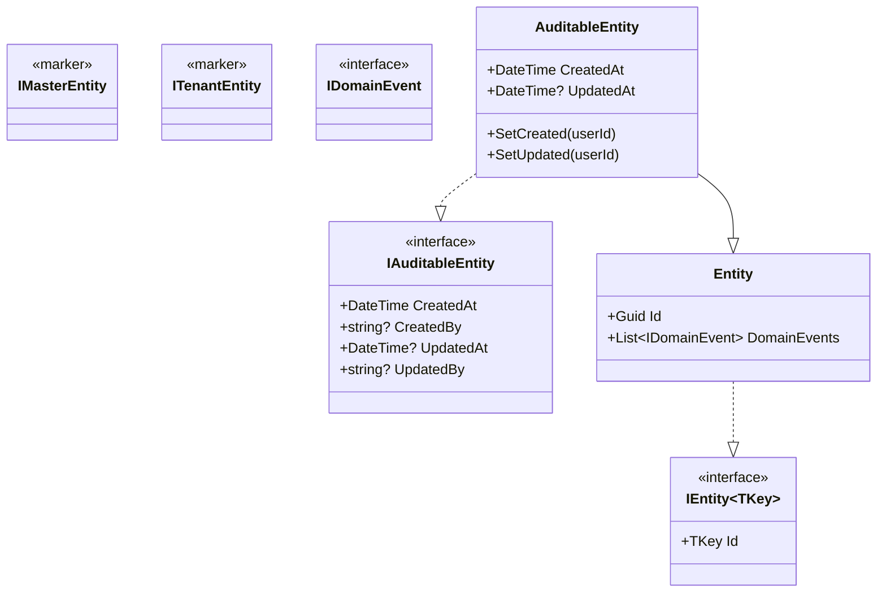
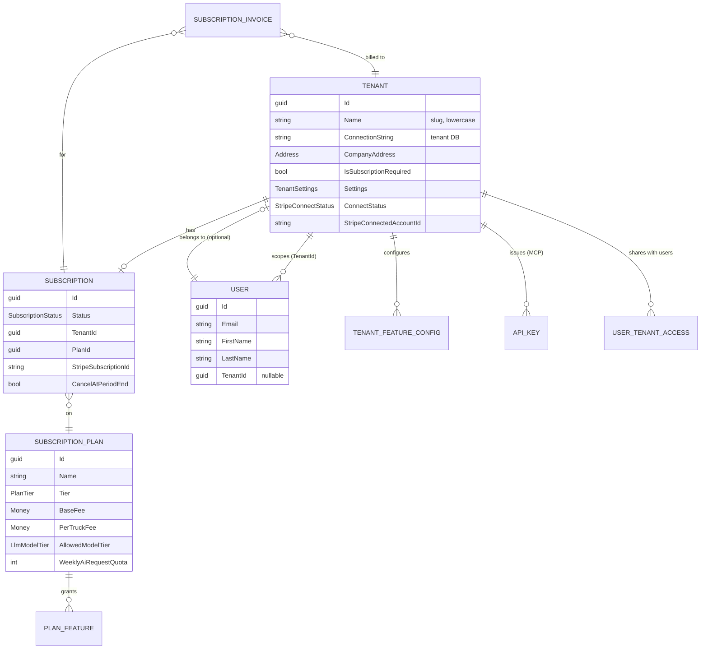
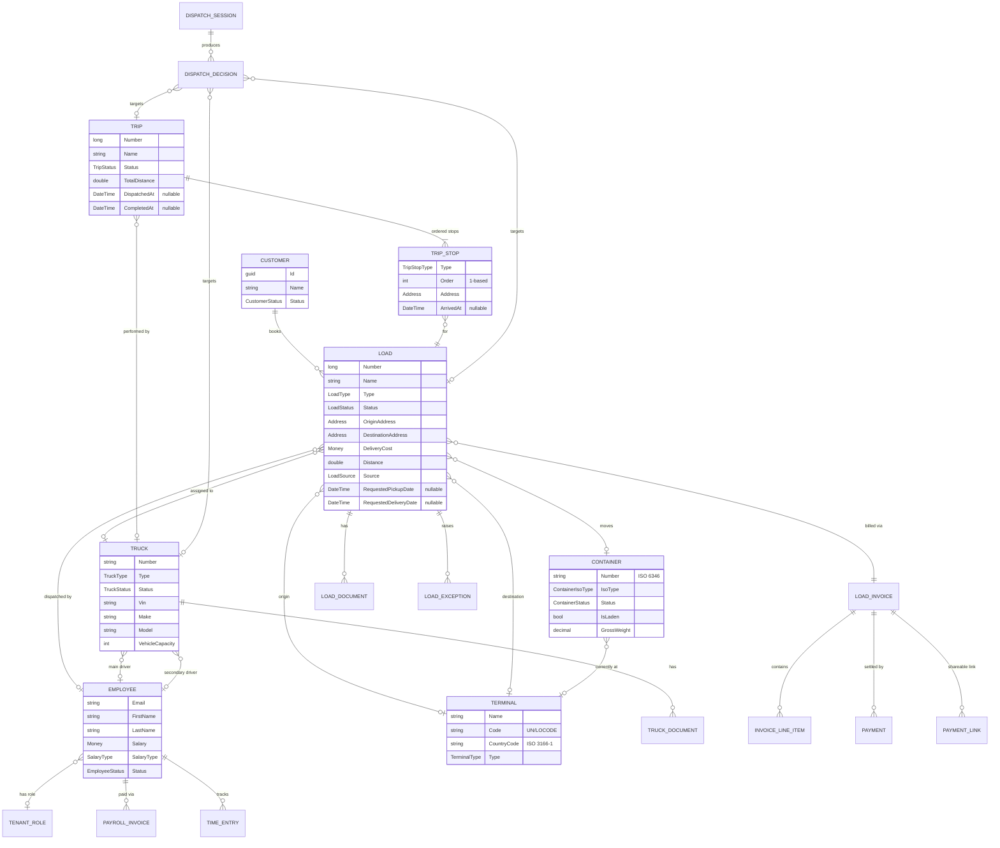
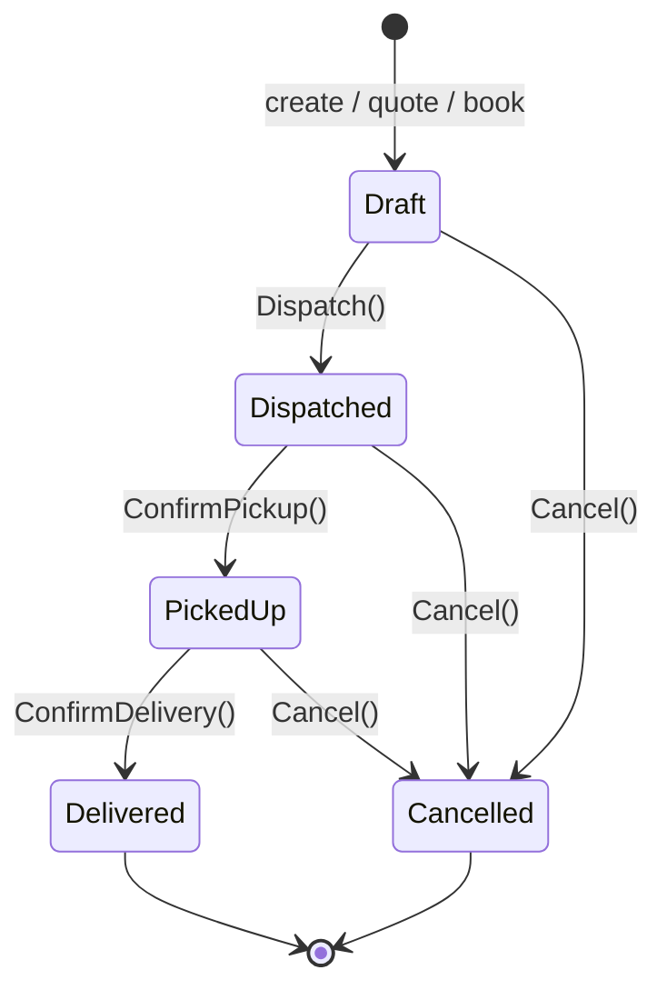
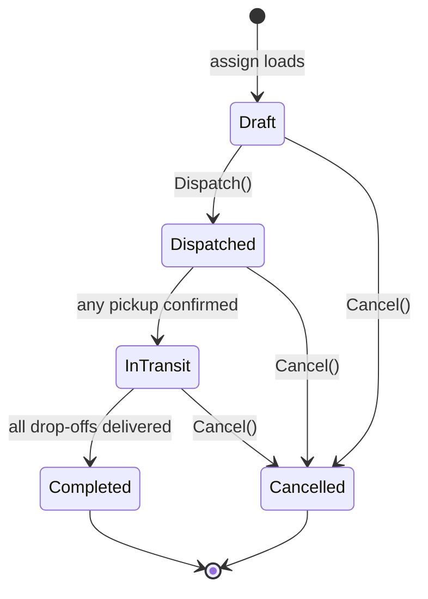
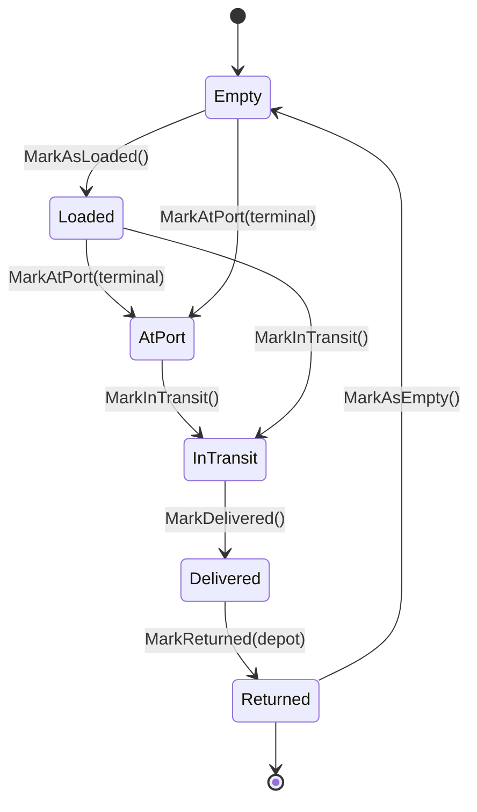
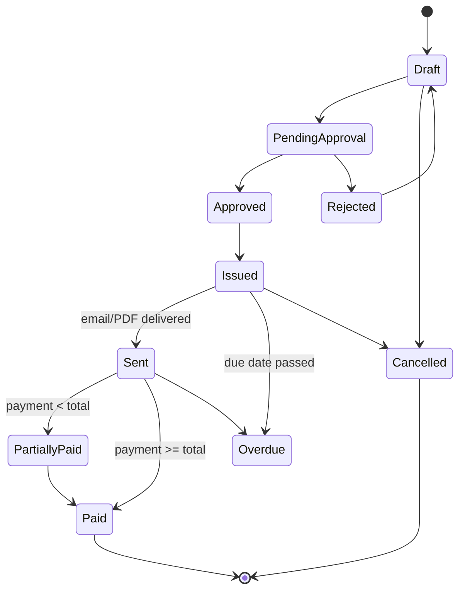
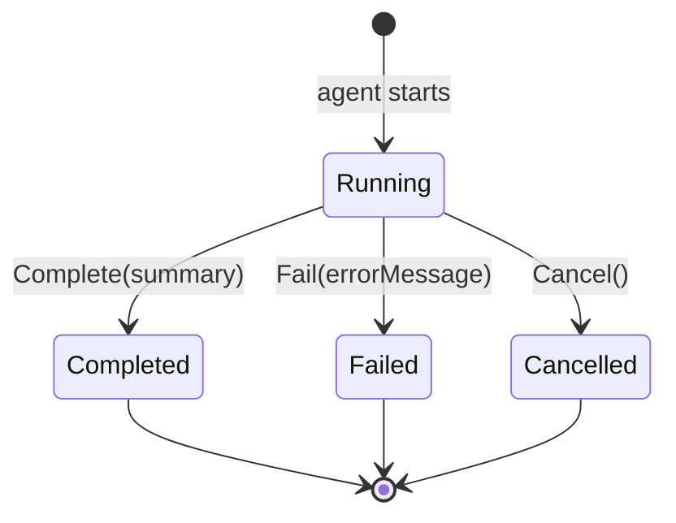
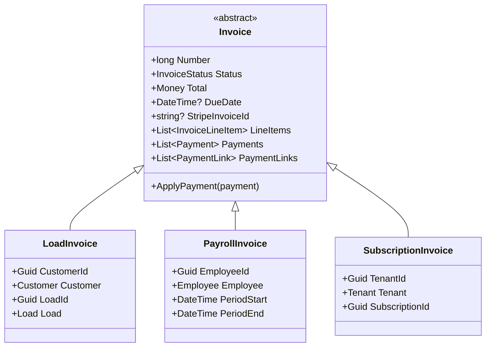
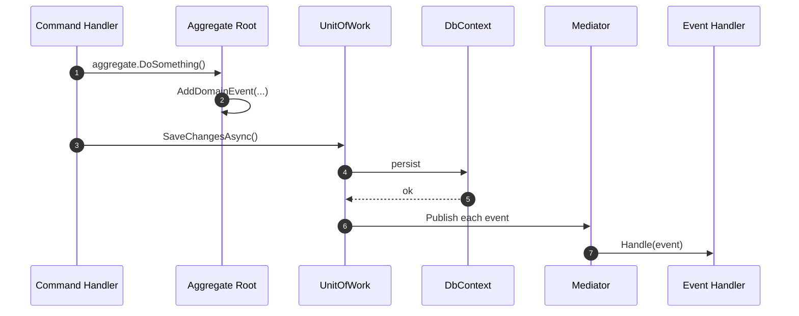

# Domain Model

The domain layer (`src/Core/Logistics.Domain/`) holds entities, aggregates, value objects, domain events, and specifications. Entities are split into two databases by marker interface:

- `IMasterEntity` - lives in the **master DB** (platform state shared across tenants).
- `ITenantEntity` - lives in **tenant DBs** (per-company operational data).

A few entities (notably `User` and `Invoice`) implement both because they need to be visible from either side.

## Base abstractions



`Entity` provides the GUID primary key and the `DomainEvents` list. `AuditableEntity` adds the four audit fields, populated by an EF Core SaveChanges interceptor in `Logistics.Infrastructure.Persistence`. The marker interfaces (`IMasterEntity`, `ITenantEntity`) drive which `DbContext` (`MasterDbContext` vs `TenantDbContext`) picks up the entity at startup.

## Master database



The master DB also stores `SuperAdmin`, `BlogPost`, `ContactSubmission`, `DemoRequest`, `SystemSetting`, `DefaultFeatureConfig`, and `ImpersonationAuditLog` / `ImpersonationToken` (used by SuperAdmins to act on behalf of a tenant).

### Tenants and subscriptions

Every customer company is one `Tenant` row. The connection string for that company's tenant DB is stored in `Tenant.ConnectionString`, which is generated from `TenantDatabaseDefaults.NameTemplate` at provisioning time (see [Multi-Tenancy](multi-tenancy.md)).

Subscriptions are 1:1 with tenants and reference a `SubscriptionPlan`. Plan tiers (Starter / Professional / Enterprise) gate features through the `PlanFeature` join table and cap LLM model access via `AllowedModelTier`.

## Tenant database

A tenant DB holds the entire operational graph for one company. The most important aggregates are **Load**, **Trip**, **Truck**, **Customer**, **Container**, and **Invoice**.



A tenant DB also includes the supporting graph: **HOS / ELD** (`HosLog`, `HosViolation`, `DriverHosStatus`, `EldDriverMapping`, `EldVehicleMapping`, `EldProviderConfiguration`), **Safety** (`DvirReport`, `DvirDefect`, `AccidentReport`, `DriverBehaviorEvent`), **Maintenance** (`MaintenanceSchedule`, `MaintenanceRecord`, `MaintenancePart`), **Expenses** (`CompanyExpense`, `TruckExpense`, `BodyShopExpense`), **Messaging** (`Conversation`, `Message`, `MessageReadReceipt`), **Load board** (`LoadBoardConfiguration`, `LoadBoardListing`, `PostedTruck`), and **Notifications** / **Tracking links**.

## Aggregates

An aggregate is a consistency boundary - the root entity is the only thing outside code can hold a reference to, and operations on the aggregate go through the root.

| Aggregate root    | Owns                                                                        |
| ----------------- | --------------------------------------------------------------------------- |
| `Tenant`          | `Subscription`, `TenantFeatureConfig[]`                                     |
| `Load`            | `LoadDocument[]`, `LoadException[]`, optional `LoadInvoice`                 |
| `Trip`            | `TripStop[]` (each stop references a `Load` but stops are part of the trip) |
| `Truck`           | `TruckDocument[]`                                                           |
| `Container`       | (lifecycle owner - referenced by `Load`)                                    |
| `Invoice` TPH     | `InvoiceLineItem[]`, `Payment[]`, `PaymentLink[]`                           |
| `DispatchSession` | `DispatchDecision[]`                                                        |
| `Conversation`    | `Message[]`, `ConversationParticipant[]`, `MessageReadReceipt[]`            |
| `DvirReport`      | `DvirDefect[]`                                                              |
| `AccidentReport`  | `AccidentThirdParty[]`, `AccidentWitness[]`                                 |

Cross-aggregate references are by `Guid` ID, not navigation property, with one important exception: EF Core lazy loading is enabled, so `virtual` navigation properties are populated on access. The codebase relies on this and avoids `.Include()` calls.

## Lifecycles (state machines)

Status transitions are enforced inside the entity, not in handlers. Each one has a dedicated `*StatusMachine` static class that decides whether a transition is legal.

### Load



`Load.Dispatch()` also flips a draft `Invoice` to `Issued`. `Load.UpdateProximity(true)` raises `LoadProximityChangedEvent` when the truck enters the geofence of the next checkpoint, enabling the driver-app pickup/delivery confirm button.

### Trip



`Trip.MarkStopArrived(stopId)` propagates the per-stop arrival to the underlying `Load` (via `force: true`) and refreshes the trip's status (`Dispatched` → `InTransit` → `Completed`). Cancelling a trip cascades a `Load.Cancel()` to every stop's load.

### Container



Every transition raises `ContainerStatusChangedEvent`. `MoveToTerminal(terminal)` is a _pure location update_ that does not change the status (used when a container is shuffled inside a yard).

### Invoice



`Invoice.ApplyPayment(payment)` adds the payment, sums all payments, and flips status to `Paid` or `PartiallyPaid` based on the total.

### Dispatch session



A session captures token usage (`InputTokensUsed`, `OutputTokensUsed`, `CacheReadTokens`, `CacheCreationTokens`), estimated USD cost, and the `RequestCost` multiplier (1 / 5 / 10) used by the AI quota system.

## Invoice hierarchy (TPH)

`Invoice` is an abstract base mapped Table-Per-Hierarchy. The discriminator is `InvoiceType`.



`LoadInvoice` and `PayrollInvoice` live in the **tenant DB**; `SubscriptionInvoice` lives in the **master DB** (platform billing). The base class implements both `IMasterEntity` and `ITenantEntity` so each subclass can be picked up by the right `DbContext`.

## Value objects

| Value object     | Used by                                            | Notes                                                           |
| ---------------- | -------------------------------------------------- | --------------------------------------------------------------- |
| `Address`        | Tenant, Customer, Load, Trip stop, Terminal, Truck | Line1/Line2, City, State, ZipCode, Country (ISO 3166-1 alpha-2) |
| `GeoPoint`       | Load (origin/destination), TripStop, Truck         | `Latitude`, `Longitude`                                         |
| `Money`          | Load, Invoice, Employee, SubscriptionPlan          | `Amount` + `Currency`. Mapped as a complex property             |
| `LoadRoute`      | Routing service                                    | Computed origin/destination + distance                          |
| `Page` / `Sort`  | Repositories / queries                             | Pagination + sort spec                                          |
| `TenantSettings` | Tenant                                             | Region, currency, units, AI provider/model, locale              |

`Money` and `Address` are mapped as **complex properties** (EF Core 8+) - they have no primary key and are inlined in the owner's table.

## Domain events

Entities raise events from their methods. Events are dispatched via MediatR after `SaveChanges` succeeds, so a failed transaction never publishes its events.



A non-exhaustive list of domain events:

- `LoadCompletedEvent`, `LoadCancelledEvent`, `LoadProximityChangedEvent`
- `TripDispatchedEvent`, `TripCompletedEvent`
- `ContainerStatusChangedEvent`
- `PayrollInvoice` events (created, approved, paid)

Handlers live in `src/Core/Logistics.Application/Events/` and produce side effects: notifications, follow-on jobs, audit log entries, etc.

## Specifications

`ISpecification<T>` encapsulates reusable query conditions used by `IRepository<T>`. They are defined in `src/Core/Logistics.Domain/Specifications/`.

```csharp
public class ActiveLoadsSpec : Specification<Load>
{
    public ActiveLoadsSpec()
        => Query.Where(l => l.Status != LoadStatus.Cancelled
                         && l.Status != LoadStatus.Delivered)
                .OrderByDescending(l => l.CreatedAt);
}

// Used by a query handler:
var activeLoads = await tenantUow.Repository<Load>().GetListAsync(new ActiveLoadsSpec(), ct);
```

Specifications keep query intent in the domain layer rather than scattered across handlers.

## Auditing

Every `AuditableEntity` gets four fields filled in automatically by an EF Core `SaveChanges` interceptor in `Logistics.Infrastructure.Persistence`:

- `CreatedAt`, `CreatedBy` - set on insert from the current user (or `system` for background jobs).
- `UpdatedAt`, `UpdatedBy` - set on every update.

Non-auditable entities (e.g. `Truck`, `Employee`, `User`) inherit only `Entity` - they have an ID but no audit columns. Lookup-style entities like `Terminal`, `Container`, `Invoice` are auditable because operations history is regulatory-relevant (custody chain, billing).

## Next Steps

- [Architecture Overview](overview.md) - layer split and infrastructure projects
- [Multi-Tenancy](multi-tenancy.md) - master vs tenant DB resolution
- [API Overview](../api/overview.md) - REST endpoints by aggregate
