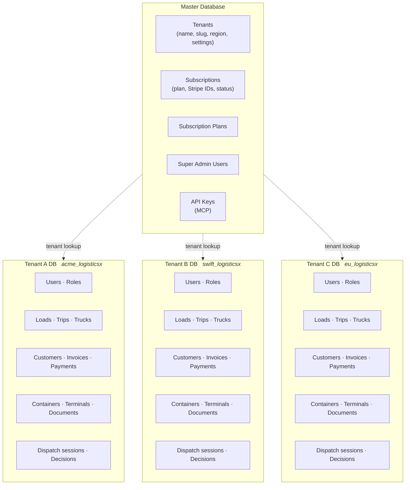
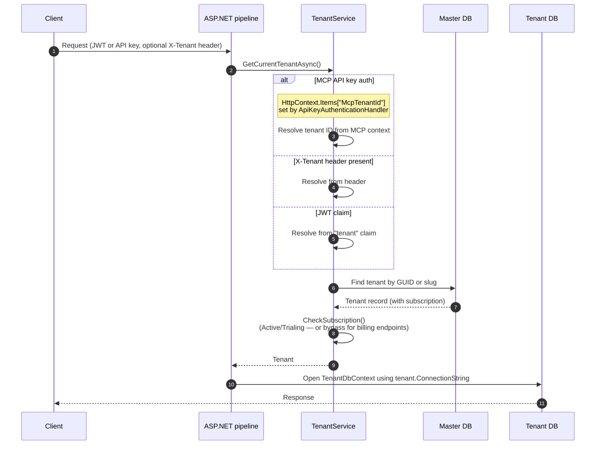

# Multi-Tenancy Architecture

LogisticsX uses **database-per-tenant** isolation: a single master database stores tenants, subscriptions, and super-admin accounts; every tenant company gets its own PostgreSQL database with the full operational schema.

## Why database-per-tenant

- **Hard isolation** - no shared rows means no risk of a leaky `WHERE TenantId = ?` filter exposing another company's data.
- **Per-tenant operations** - independent backups, restores, and migrations per company.
- **Simpler compliance** - GDPR / data-residency requests scope to a single database.
- **Performance predictability** - one tenant's noisy queries don't scan another tenant's rows.

The trade-off is more databases to manage. The codebase compensates with `TenantDatabaseService`, which provisions and tears down tenant DBs programmatically, and `Logistics.DbMigrator`, which fans migrations out across every tenant DB.

## Overview



### Master database

Holds platform-level data shared across all tenants:

- **Tenants** - company record, slug, region (US / EU), settings, AI provider/model selection
- **Subscriptions / Plans** - billing state, Stripe customer + subscription IDs, plan tier
- **SuperAdmin users** - platform operators with cross-tenant access
- **API keys** - MCP API keys (`logsx_{tenantId}_{random}`), scoped to a tenant

### Tenant database

One per company. Schema includes:

- Users, roles, invitations
- Customers, loads, trips, trucks, drivers
- Invoices, payments, payment links, payroll
- Containers (ISO 6346), terminals (UN/LOCODE), documents
- ELD logs, safety inspections, maintenance
- AI dispatch sessions and decisions
- Notifications, chat messages, tracking links

## Tenant resolution

On every HTTP request, `TenantService.GetCurrentTenantAsync` resolves the active tenant by checking three sources in priority order, then validates the subscription before returning the tenant.



### Resolution priority

1. **MCP API key context** - when `ApiKeyAuthenticationHandler` validates a `logsx_*` key, it stores the resolved tenant ID in `HttpContext.Items["McpTenantId"]`. This always wins so MCP requests never need an `X-Tenant` header.
2. **`X-Tenant` HTTP header** - used by the Angular portals and direct API consumers. Accepts either the tenant GUID or the tenant slug.
3. **JWT `tenant` claim** - issued by `IdentityServer` when the user logs in. Used by clients that don't manage their own tenant header.

If none of the three resolve, `InvalidTenantException` is thrown.

### Background jobs and migrations

When there is no `HttpContext` (Hangfire workers, `DbMigrator`, integration tests), `TenantService` returns a default tenant pointing at the connection string from `TenantDbContextOptions`. Jobs that need to run for a specific tenant set the connection string explicitly before opening `TenantDbContext`.

### Subscription enforcement

`CheckSubscription` runs immediately after the tenant is resolved:

- If `Tenant.IsSubscriptionRequired == false` (e.g. internal/demo tenants), the check is skipped.
- Endpoints under `/payments/methods` and `/subscriptions` bypass the check so a customer with an expired plan can still update billing.
- Otherwise the subscription must be `Active` or `Trialing`. Anything else throws `SubscriptionExpiredException`.

## Configuration

```json
{
  "ConnectionStrings": {
    "MasterDatabase": "Host=localhost;Port=5432;Database=master_logisticsx;Username=postgres;Password=...;Pooling=true;Maximum Pool Size=20"
  },
  "TenantDatabaseDefaults": {
    "NameTemplate": "{tenant}_logisticsx",
    "Host": "localhost",
    "Port": 5432,
    "UserId": "postgres",
    "Password": "..."
  }
}
```

`TenantDatabaseDefaults.NameTemplate` is the only piece of dynamic config the runtime needs to know about - everything else (host, port, credentials) is the same for every tenant DB on a given server. The `{tenant}` token is replaced with the tenant slug at provisioning time.

### Naming convention

Tenant databases follow `{tenant_slug}_logisticsx` - for example `acme_logisticsx`, `swift_transport_logisticsx`, `default_logisticsx`. Slugs are normalized to lowercase before lookup.

## Provisioning a new tenant

```mermaid
sequenceDiagram
    autonumber
    participant Admin
    participant API as Logistics.API
    participant TS as TenantService
    participant TDS as TenantDatabaseService
    participant Master as Master DB
    participant Postgres
    participant TDb as New Tenant DB

    Admin->>API: POST /tenants (CreateTenantCommand)
    API->>Master: Insert Tenant row (slug, region, settings)
    API->>TDS: GenerateConnectionString(slug)
    TDS-->>API: "Host=...;Database=acme_logisticsx;..."
    API->>Postgres: Create database
    API->>TDS: CreateDatabaseAsync(connectionString)
    TDS->>TDb: Apply EF Core migrations
    TDS->>TDb: Seed roles & permissions
    API->>TDb: Seed initial owner user, default settings
    API->>Master: Update Tenant.ConnectionString
    API-->>Admin: Tenant created
```

Provisioning is fully programmatic - the operator does not run psql or migrations by hand. Tear-down (`DeleteDatabaseAsync`) terminates active connections via `pg_terminate_backend` before issuing `DROP DATABASE`, so a stuck connection cannot block a deletion.

## Connection pooling

With many tenants the connection-pool budget matters. Every tenant DB shares the same Postgres credentials, so Npgsql pools per (host, database, user) tuple:

- The master DB pool is shared across all requests.
- Each tenant DB pool is created lazily on first use and reused for subsequent requests for that tenant.
- Idle pools are reaped by Npgsql defaults; tune `Maximum Pool Size` per environment.

For very large fleet counts, run multiple Postgres instances and shard tenants across them - the runtime only needs the right `ConnectionString` on the `Tenant` record.

## Migrations

`Logistics.DbMigrator` is a console app that:

1. Applies master migrations against the master DB.
2. Iterates over `Tenants` in the master DB and applies tenant migrations against each tenant DB.
3. Optionally runs seeders (idempotent, ordered by `SeederBase.Order`).

This is invoked manually for production rollouts and automatically by `Logistics.Aspire.AppHost` for local development.

## Trade-offs and limits

| Concern              | Approach                                                                                                            |
| -------------------- | ------------------------------------------------------------------------------------------------------------------- |
| Cross-tenant queries | Not supported by design. SuperAdmin features that need aggregates run per-tenant or read from the master DB only.   |
| Schema drift         | Mitigated by always running migrations through `DbMigrator` rather than ad-hoc SQL.                                 |
| Bulk migrations      | `DbMigrator` runs them serially; for very large tenant counts, parallelize by sharding the tenant list across runs. |
| Backup costs         | One backup per tenant DB - cost scales with tenant count, but each backup is small and restore is per-tenant.       |

## Next Steps

- [Domain Model](domain-model.md) - entity relationships
- [API Authentication](../api/authentication.md) - JWT and tenant claims
- [MCP Server](../mcp-server.md) - API key authentication and tenant scoping
