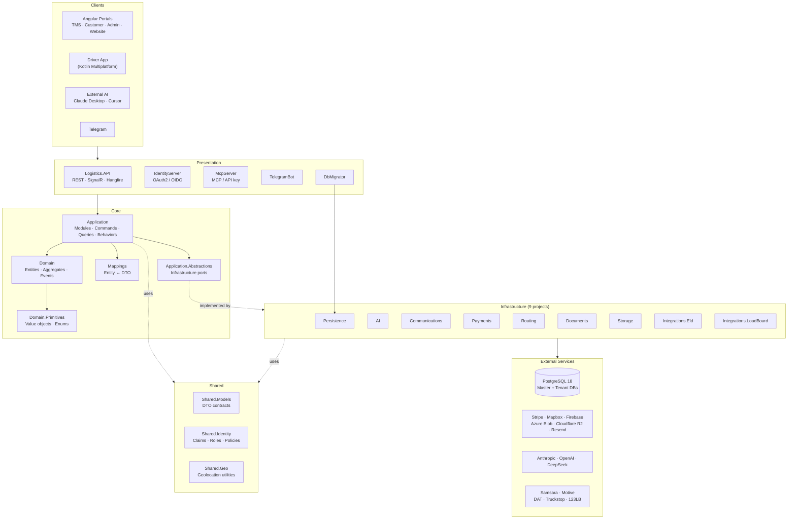
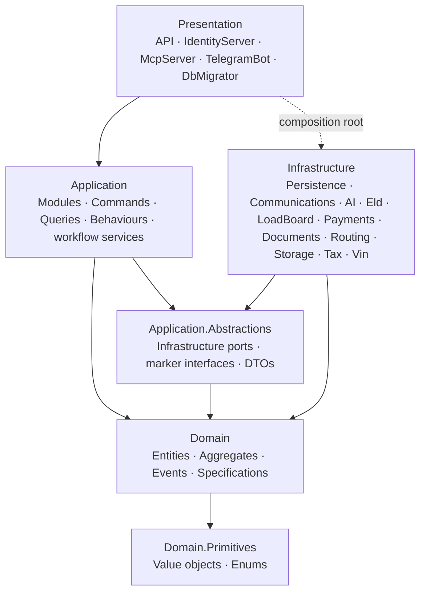
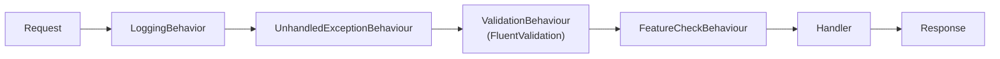

# Architecture Overview

LogisticsX is a Domain-Driven Design (DDD) monolith with CQRS, organized into clear layers and a modular infrastructure split into focused projects. The runtime is .NET 10 on PostgreSQL 18, orchestrated by .NET Aspire.

> See [layering.md](layering.md) for the 4-layer rule and the Abstractions / Application split. See [module-layout.md](module-layout.md) for the Application `Modules/` layout.

## System Architecture



## Layered Design

The codebase follows a Clean / Onion architecture: `Domain ← Abstractions ← Application/Infrastructure ← Presentation`. Application depends on `Application.Abstractions` for infrastructure ports; Infrastructure implements those ports and **never** references `Application`. See [layering.md](layering.md) for the port vs. workflow-service rule.



Application is wired to infrastructure implementations only at the **composition root**. Each module ships its own DI registrar inside `Logistics.Application/Modules/{Module}/` and each infrastructure project ships a registrar (`AddPersistenceInfrastructure`, `AddPaymentsInfrastructure`, …) consumed by every presentation `Program.cs`.

### Architecture enforcement

Layering rules are enforced by [`test/Logistics.Architecture.Tests/`](../../test/Logistics.Architecture.Tests/) (ArchUnitNET over compiled assemblies):

- `Application` must not depend on `Microsoft.AspNetCore.Http` or any Infrastructure assembly.
- `Application.Abstractions` must not depend on `Application`, Infrastructure, EF Core, or AspNetCore.Http.
- Each Infrastructure assembly references `Application.Abstractions`, not `Application`.
- No handler injects `IHttpContextAccessor`.

Adding a new infrastructure assembly? Append its anchor to the `[Theory]` in `BoundaryTests.cs` so it's covered.

## Project Structure

The repository follows the layer split above. Each project name is `Logistics.{Layer}.{Module}`.

| Folder               | Projects                                                                                                                                                                            |
| -------------------- | ----------------------------------------------------------------------------------------------------------------------------------------------------------------------------------- |
| `src/Aspire`         | `Logistics.Aspire.AppHost`, `Logistics.Aspire.ServiceDefaults`                                                                                                                      |
| `src/Client`         | `Logistics.Angular` (workspace: tms-portal, customer-portal, admin-portal, website, shared library), `Logistics.DriverApp` (Kotlin Multiplatform), `Logistics.DemoVideo` (Remotion) |
| `src/Core`           | `Logistics.Application`, `Logistics.Application.Abstractions`, `Logistics.Domain`, `Logistics.Domain.Primitives`, `Logistics.Mappings`                                              |
| `src/Shared`         | `Logistics.Shared.Geo`, `Logistics.Shared.Identity`, `Logistics.Shared.Models`                                                                                                      |
| `src/Infrastructure` | `Persistence`, `Communications`, `AI`, `Integrations.Eld`, `Integrations.LoadBoard`, `Payments`, `Documents`, `Routing`, `Storage`                                                  |
| `src/Presentation`   | `Logistics.API`, `Logistics.IdentityServer`, `Logistics.McpServer`, `Logistics.TelegramBot`, `Logistics.DbMigrator`                                                                 |

## Tech Stack

### Backend

| Technology            | Purpose                                       |
| --------------------- | --------------------------------------------- |
| .NET 10               | Runtime                                       |
| ASP.NET Core          | Web framework                                 |
| Entity Framework Core | ORM (lazy loading enabled)                    |
| Duende IdentityServer | OAuth2 / OIDC                                 |
| MediatR               | CQRS dispatch + pipeline behaviors            |
| FluentValidation      | Request validation                            |
| Serilog               | Structured logging                            |
| SignalR               | Real-time hubs (tracking, chat, notification) |
| Hangfire              | Background jobs                               |
| QuestPDF              | Invoice & payroll PDF generation              |
| .NET Aspire           | Local orchestration & observability           |

### Frontend & Mobile

| Technology            | Used by                                   |
| --------------------- | ----------------------------------------- |
| Angular 21 + PrimeNG  | TMS Portal, Customer Portal, Admin Portal |
| Angular 21 SSR        | Marketing Website                         |
| Tailwind CSS          | All Angular projects                      |
| Kotlin Multiplatform  | Driver App (shared business logic)        |
| Compose Multiplatform | Driver App UI                             |
| Remotion              | DemoVideo (programmatic marketing video)  |

### Infrastructure & DevOps

| Technology     | Purpose          |
| -------------- | ---------------- |
| PostgreSQL 18  | Database         |
| Docker         | Containerization |
| .NET Aspire    | Orchestration    |
| Nginx          | Reverse proxy    |
| GitHub Actions | CI/CD            |

### External Services

| Service                        | Purpose                                 |
| ------------------------------ | --------------------------------------- |
| Stripe                         | Subscription billing                    |
| Stripe Connect                 | Direct payouts to trucking companies    |
| Anthropic / OpenAI / DeepSeek  | LLM providers for the AI dispatch agent |
| Firebase                       | Push notifications                      |
| Mapbox                         | Maps, geocoding, route optimization     |
| Azure Blob / Cloudflare R2     | Document & photo storage (pluggable)    |
| NHTSA API                      | VIN decoding                            |
| Samsara / Motive               | ELD / HOS providers                     |
| DAT / Truckstop / 123Loadboard | Load board providers                    |
| Resend                         | Transactional email                     |
| Google reCAPTCHA               | Public form protection                  |

## Design Patterns

### CQRS

Commands and queries are separated and dispatched through MediatR. Both extend `IRequest<TResponse>` via the `ICommand<T>` / `IQuery<T>` markers in `Logistics.Application.Abstractions.Common`. Use `IMasterCommand<T>` for commands that target the master DB, otherwise the tenant DB. Handlers own their own `SaveChangesAsync` calls — there is no auto-transaction wrapper.

Commands and queries live under `Logistics.Application/Modules/{Module}/{Feature}/{Commands|Queries}/`. See [module-layout.md](module-layout.md) for the six modules and the feature-folder convention.

```csharp
public record CreateLoadCommand(CreateLoadDto Dto) : ICommand<Result<LoadDto>>;
public record GetLoadByIdQuery(string Id) : IQuery<Result<LoadDto>>;
```

### MediatR Pipeline

A single pipeline applies to both commands and queries. Behaviours are constrained to `IRequest<TResponse>` where `TResponse : IResult, new()`, so they bind to `ICommand<T>` and `IQuery<T>` alike.



`FeatureCheckBehaviour` reads the optional `[RequiresFeature]` attribute on the request type and short-circuits with a `Result.Fail` when the tenant's plan or admin lock disables the feature; the lookup is cached per closed generic instantiation.

### Repository + Specification

Repositories are scoped per aggregate root; specifications encapsulate reusable query conditions.

```csharp
public interface IRepository<T> where T : class, IAggregateRoot
{
    Task<T?> GetAsync(ISpecification<T> spec, CancellationToken ct = default);
    Task<IList<T>> GetListAsync(ISpecification<T> spec, CancellationToken ct = default);
    Task AddAsync(T entity, CancellationToken ct = default);
    void Update(T entity);
    void Delete(T entity);
}

public class ActiveLoadsSpec : Specification<Load>
{
    public ActiveLoadsSpec()
        => Query.Where(l => l.Status == LoadStatus.Active)
                .OrderByDescending(l => l.CreatedDate);
}
```

### Domain Events

Entities raise events from inside their methods. Handlers live next to the feature in `Logistics.Application/Modules/{Module}/{Feature}/Events/`.

```csharp
public class Load : AggregateRoot
{
    public void Complete()
    {
        Status = LoadStatus.Completed;
        AddDomainEvent(new LoadCompletedEvent(this));
    }
}
```

### Unit of Work

There are two UoWs - one per database type:

- `IMasterUnitOfWork` - master DB (tenants, subscriptions, super admins)
- `ITenantUnitOfWork` - per-request tenant DB resolved via `ITenantService`

## Infrastructure Projects

The infrastructure layer is split into nine focused projects so each has a single concern.

### Logistics.Infrastructure.Persistence

Database access, repositories, and multi-tenancy.

- `MasterDbContext` (tenants, subscriptions, super admins) and `TenantDbContext` (per-company operational data)
- 40+ entity configurations, organized by domain (`Load/`, `Trip/`, `Invoice/`, `Container/`, `Eld/`, `Safety/`, ...)
- Master and Tenant migrations
- `IRepository<T>`, `IUnitOfWork`, and tenant-aware `DbContextFactory`s
- `TenantService` (resolves the current tenant) and `TenantDatabaseService` (provisions tenant DBs)
- EF Core interceptors for domain events and auditing

### Logistics.Infrastructure.Communications

Real-time and outbound messaging.

- SignalR hubs: `TrackingHub`, `ChatHub`, `NotificationHub`
- Email via Resend with Fluid templates
- Push notifications via Firebase Cloud Messaging
- Google reCAPTCHA validation

### Logistics.Infrastructure.AI

LLM dispatch agent and tool registry.

- `ILlmProvider` adapter pattern with `AnthropicLlmProvider` (Claude SDK) and `OpenAiLlmProvider` (OpenAI-compatible: OpenAI, DeepSeek, GLM)
- `AiDispatchService` agent loop (max 25 iterations, prompt caching, extended thinking)
- `AiDispatchToolRegistry` - shared tool definitions used by both the agent and the MCP server
- Quota tracking with multiplier-based weekly limits (1x / 5x / 10x by model tier)
- Model tier gating by subscription plan (Base / Premium / Ultra)

See [AI Dispatch](../ai-dispatch.md).

### Logistics.Infrastructure.Integrations.Eld

ELD providers for HOS compliance: Samsara, Motive (KeepTruckin), and a Demo provider for tests. Factory pattern for provider selection plus webhook handlers signed by the provider.

### Logistics.Infrastructure.Integrations.LoadBoard

Load board providers: DAT, Truckstop, 123Loadboard, and a Demo provider. Search loads, post trucks, provider-specific request/response mappers.

### Logistics.Infrastructure.Payments

- Stripe subscriptions (platform billing)
- Stripe Connect destination charges (direct payouts to trucking companies)
- Payment links with expiration
- Stripe webhook handling with signature validation

### Logistics.Infrastructure.Documents

- PDF generation via QuestPDF (invoices, payroll stubs, BOL, POD)
- Template-based PDF import / extraction
- VIN decoder (NHTSA API)

### Logistics.Infrastructure.Routing

- Heuristic trip optimizer (nearest neighbor)
- Mapbox Matrix-based optimizer
- Composite optimizer combining both
- Mapbox geocoding and trip tracking

### Logistics.Infrastructure.Storage

- `IBlobStorageService` abstraction with three pluggable providers, selected via the `BlobStorage:Type` configuration value:
  - **Azure Blob Storage** (`azure`) - production default for Azure-hosted deployments
  - **Cloudflare R2** (`r2` / `cloudflare`) - S3-compatible storage via the AWS SDK; cost-efficient zero-egress option
  - **Local file system** (default) - used for development and on-prem
- Storage abstraction shared by Documents and Communications

```json
{
  "BlobStorage": { "Type": "r2" },
  "R2BlobStorage": {
    "AccountId": "...",
    "AccessKeyId": "...",
    "SecretAccessKey": "...",
    "BucketName": "logisticsx"
  }
}
```

## Presentation Projects

| Project                    | Role                                                                                                 |
| -------------------------- | ---------------------------------------------------------------------------------------------------- |
| `Logistics.API`            | REST API, SignalR hubs, Hangfire background jobs, webhooks (Stripe, ELD)                             |
| `Logistics.IdentityServer` | OAuth2 / OIDC via Duende IdentityServer, JWT issuance, user management                               |
| `Logistics.McpServer`      | MCP over Streamable HTTP at `/mcp`; exposes `AiDispatchToolRegistry` to Claude Desktop, Cursor, etc. |
| `Logistics.TelegramBot`    | Telegram bot worker for driver / dispatcher commands                                                 |
| `Logistics.DbMigrator`     | Standalone EF Core migrations runner (master + tenant)                                               |

## Multi-Tenancy

LogisticsX uses **database-per-tenant** isolation. See [Multi-Tenancy](multi-tenancy.md) for the full architecture, request flow, and provisioning sequence.

## Next Steps

- [Domain Model](domain-model.md) - entity relationships
- [Multi-Tenancy](multi-tenancy.md) - database isolation strategy
- [API Overview](../api/overview.md) - REST API design
- [AI Dispatch](../ai-dispatch.md) - agent architecture and tools
- [MCP Server](../mcp-server.md) - external AI integration
