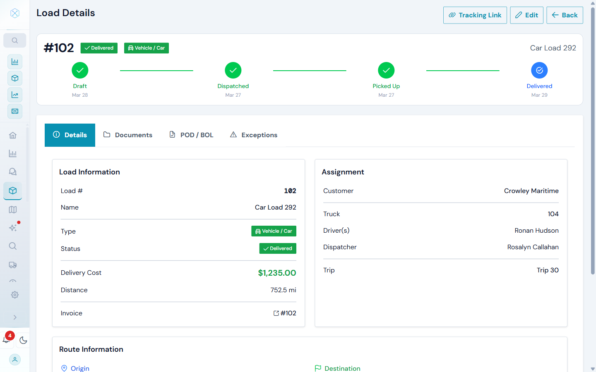
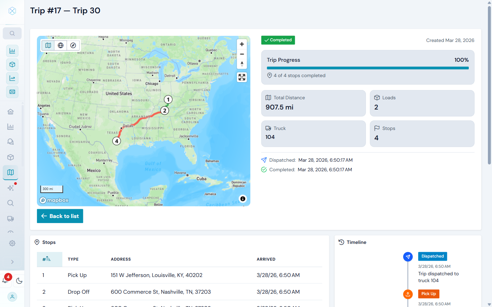
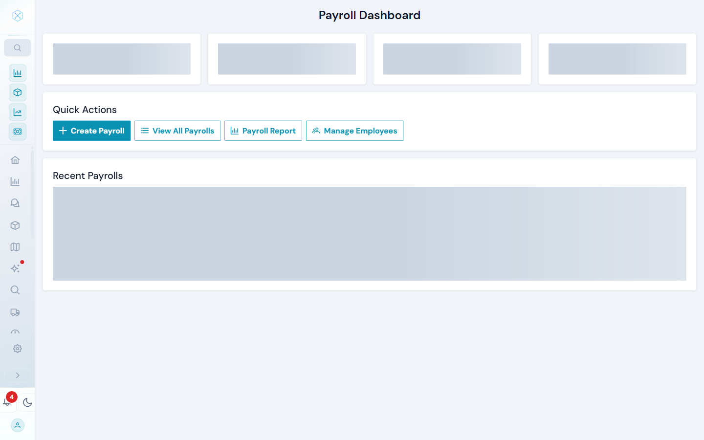
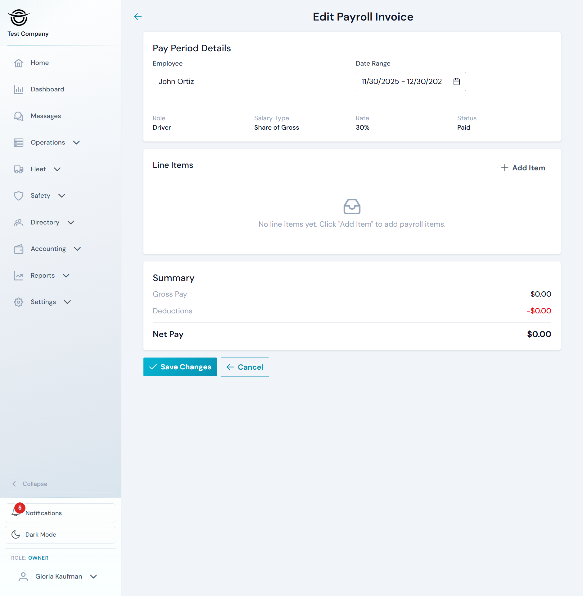

# Screenshots

Visual tour of Logistics TMS applications.

## TMS Portal (Angular)

The dispatcher and manager web interface for managing loads, customers, operations, invoices, payrolls, and more.

### Dashboard

### Load Management

### Trips & Route Optimization

### Fleet & Trucks

### Invoicing & Payments

### Payroll

### Reports

---

## Customer Portal (Angular)

Self-service portal for customers to track shipments, view documents, and access invoices.

### Dashboard

### Shipment Details

---

## Driver Mobile App (Kotlin Multiplatform)

Native driver app built with Kotlin Multiplatform and Compose, supporting both Android and iOS.

### Dashboard & Statistics

| Dashboard | Statistics |
|:---------:|:----------:|
|  |  |

### Charts & Analytics

| Bar Chart | Line Chart |
|:---------:|:----------:|
|  |  |

### Load Details & Maps

| Load Details | Map View |
|:------------:|:--------:|
|  |  |

### Account & Settings

| Account | Settings |
|:-------:|:--------:|
|  |  |
